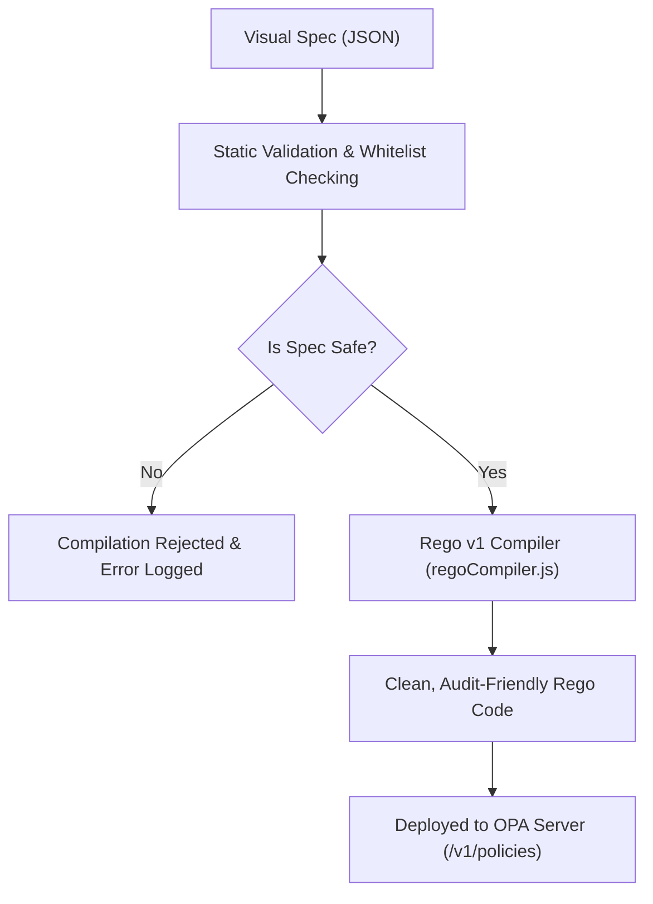
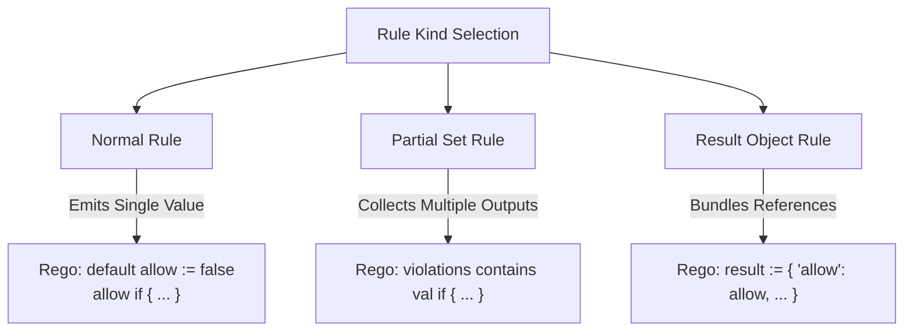
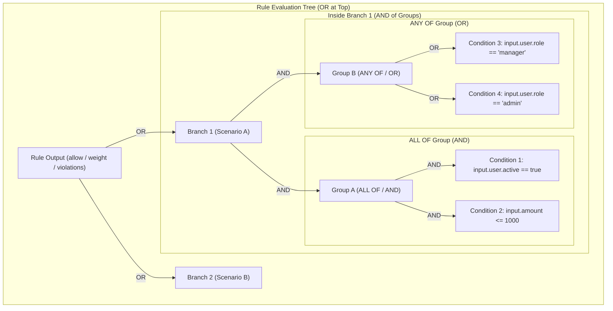
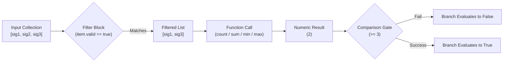
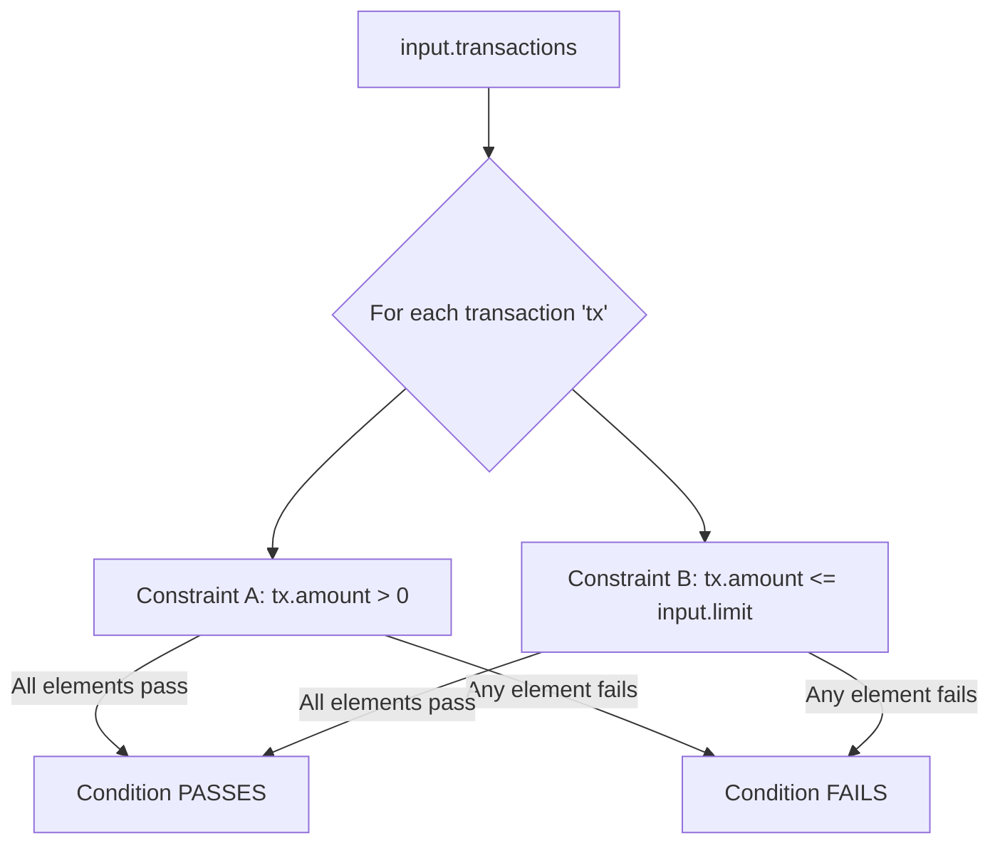
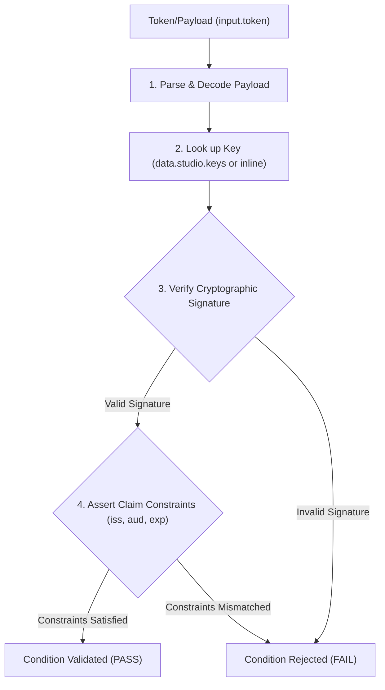
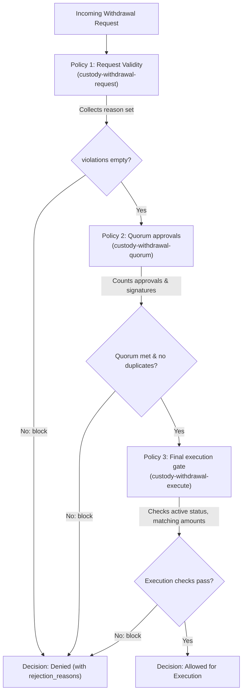

# Comprehensive Policy Building — Use Cases & Reference

A field guide for policy authors using the Visual Builder. It explains every concept the
builder exposes, the real-world question each one answers, and shows a worked example
from the bundled templates for every feature.

> Pair this document with the **Templates** menu in Aegis Studio — every example below
> is loadable as a starting point and editable in the Visual Builder.

---

## Table of contents

1. [Introduction — what a policy is](#1-introduction)
2. [The mental model — Policy → Rule → Branch → Group → Condition](#2-the-mental-model)
3. [Rules](#3-rules)
   - 3.1 [What a rule is](#31-what-a-rule-is)
   - 3.2 [Rule kinds — Normal, Partial set, Result object](#32-rule-kinds)
   - 3.3 [Rule types — boolean, string, number, object](#33-rule-types)
   - 3.4 [The `default` field](#34-the-default-field)
4. [Branches and groups — OR / AND nesting](#4-branches-and-groups)
5. [Conditions — the standard form](#5-conditions--the-standard-form)
6. [Advanced condition types](#6-advanced-condition-types)
   - 6.1 [`arith` — arithmetic comparison](#61-arith)
   - 6.2 [`aggregate` — count / sum / min / max](#62-aggregate)
   - 6.3 [`every` — universal quantifier](#63-every)
   - 6.4 [`builtin_left` — time builtins](#64-builtin_left)
   - 6.5 [`object_get` — safe map access](#65-object_get)
   - 6.6 [`raw` — escape hatch](#66-raw)
   - 6.7 [`verification` — low-level crypto](#67-verification)
   - 6.8 [`verify` — high-level signature verification](#68-verify)
   - 6.9 [Combining cryptographic auth with business rules](#69-auth--business)
7. [The Trust Keys store](#7-the-trust-keys-store)
8. [End-to-end walkthroughs](#8-end-to-end-walkthroughs)
   - 8.1 [Custody withdrawal with quorum](#81-custody-withdrawal-with-quorum)
   - 8.2 [Tiered approval with violations](#82-tiered-approval-with-violations)
   - 8.3 [Multi-tenant SaaS access](#83-multi-tenant-saas-access)
9. [Quick reference (appendix)](#9-quick-reference)

---

## 1. Introduction

A **policy** is a set of rules that an external system asks at decision time:
*"Should I allow this action?"*, *"What is the violation list?"*, *"What's the user's
vote weight?"*. The studio lets you author those rules visually as JSON specs; the
backend then compiles each spec to **Rego v1** and deploys it to OPA. Your callers
(an API, a PEP, a batch job) hit OPA, OPA evaluates the rule against the request,
and OPA returns the answer.

You never write Rego by hand. You build a tree of declarative widgets and Aegis Studio
emits clean, audit-friendly Rego beneath it. The **Rego** tab in the policy editor
always shows you exactly what the system will run.

### Compilation Life Cycle



---

## 2. The mental model

Everything in the builder fits into one nested structure:

```mermaid
graph TD
    Policy["Policy (File / Namespace)"] --> Rule1["Rule 1: allow (Normal)"]
    Policy --> Rule2["Rule 2: violations (Partial Set)"]
    
    Rule1 -->|Normal Kind| DefaultVal["default allow := false"]
    Rule1 -->|OR (Alternative 1)| Branch1["Branch A (Retail limit check)"]
    Rule1 -->|OR (Alternative 2)| Branch2["Branch B (VIP whitelist bypass)"]
    
    Branch1 -->|AND (Clause 1)| Group1["Group 1 (mode: and)"]
    Branch1 -->|AND (Clause 2)| Group2["Group 2 (mode: or)"]
    
    Group1 -->|Atom 1| Cond1["Condition: input.user.tier == 'retail'"]
    Group1 -->|Atom 2| Cond2["Condition: input.amount <= 10000"]
    
    Group2 -->|Atom 3| Cond3["Condition: input.status == 'active'"]
    Group2 -->|Atom 4| Cond4["Condition: input.status == 'provisional'"]
```

```
Policy
└── Rule                      ← a named output: allow, violations, weight, decision, ...
    ├── default               ← value returned when no branch matches (Normal rule only)
    ├── (fields)              ← key/value pairs (Result object kind only)
    └── Branch                ← alternative — branches OR together at the rule level
        ├── description       ← becomes a Rego comment
        └── Group             ← groups AND together inside a branch
            ├── mode          ← ALL OF (AND)  |  ANY OF (OR)
            └── Condition     ← the atom: comparison, arith, aggregate, every, verify, ...
```

The **rule** is the unit of output. **Branches** let you express *"any of these
scenarios proves the rule true"*. **Groups** let you bundle conditions with a
shared logical mode. **Conditions** are atomic boolean tests over `input`, `data`,
or other rules.

When you add structure, the Rego the compiler emits follows mechanically:

| Builder primitive            | Rego construct                                       |
|------------------------------|------------------------------------------------------|
| Two branches in a rule       | Two rule heads with the same name (multi-head)       |
| Group with `mode: "and"`     | Conditions are listed inline (sequential, all must hold) |
| Group with `mode: "or"`      | A generated helper rule with multi-head bodies       |
| `negate: true` on condition  | The condition is wrapped in `not (...)`              |
| `default` on a rule          | `default <name> := <value>` line above the heads     |
| Partial set kind             | `<name> contains <value> if { ... }` heads           |
| Result object kind           | `<name> := { key1: val1, key2: val2 }`               |

Keep this table in mind — when the Rego tab surprises you, the answer is almost
always in this mapping.

---

## 3. Rules

### 3.1 What a rule is

A **rule** is a named output your policy exposes. A typical authorization policy
has at least an `allow` rule (boolean). Richer policies expose multiple rules so
the caller can ask for a decision *and* an explanation, or a permission *and* a
required signal (e.g. `audit_required`).

When you click **"+ Add another rule"** you get a Normal boolean rule with one
empty branch. From there you can rename it, change its kind, change its type,
and add branches.

### 3.2 Rule kinds

The kind dropdown offers three values:



| Kind            | What it produces                              | Use it for                                            |
|-----------------|-----------------------------------------------|-------------------------------------------------------|
| Normal rule     | A single value (true/false, string, number, object) | `allow`, `vote_weight`, `risk_band`                  |
| Partial set     | A *set* of values, one per matching branch    | `violations`, `reasons`, `flags`                      |
| Result object   | A static document of key/value fields         | `decision`, `result` — bundling other rules together  |

#### 3.2.1 Normal rule — `allow` (boolean)

The simplest pattern: one rule, one or more branches, each branch a list of
conditions that must all hold. From the **KYC / AML Baseline** template
([backend/src/templates/digitalAssets.js](backend/src/templates/digitalAssets.js)):

```js
{
  name: "allow",
  type: "boolean",
  default: false,
  branches: [
    {
      description: "All gates pass simultaneously",
      conditions: [
        { left: "input.user.kyc_status", op: "==", right: "verified", rightType: "string" },
        { left: "input.user.sanctioned",  op: "==", right: false,      rightType: "boolean" },
        { left: "input.user.risk_score",  op: "<=", right: 70,         rightType: "number"  },
      ],
    },
  ],
}
```

Compiles to:

```rego
default allow := false

allow if {
    input.user.kyc_status == "verified"
    input.user.sanctioned == false
    input.user.risk_score <= 70
}
```

Real-world question answered: *"Is this user cleared for any transaction at all?"*

#### 3.2.2 Partial set — `violations`

A partial set is the right shape whenever you want to *collect reasons* rather
than make a single yes/no decision. Each branch independently can contribute one
element to the set. From the **Custody Withdrawal — Request Validity** template
([backend/src/templates/custodyHierarchy.js](backend/src/templates/custodyHierarchy.js)):

```js
{
  name: "violations",
  kind: "partial_set",
  branches: [
    {
      value: "not_vault_admin",
      valueType: "string",
      description: "Actor is not a vault admin",
      groups: [{
        mode: "and",
        conditions: [
          { left: "input.actor.vault_role", op: "!=", right: "vault_admin", rightType: "string" },
        ],
      }],
    },
    {
      value: "missing_mfa",
      valueType: "string",
      description: "Actor did not complete MFA",
      groups: [{
        mode: "and",
        conditions: [
          { left: "input.actor.mfa_verified", op: "!=", right: true, rightType: "boolean" },
        ],
      }],
    },
    {
      value: "amount_exceeds_limit",
      valueType: "string",
      description: "Requested amount exceeds the vault's daily limit",
      groups: [{
        mode: "and",
        conditions: [
          { left: "input.request.amount", op: ">", right: "input.vault.daily_limit_usd", rightType: "ref" },
        ],
      }],
    },
    // …many more reason-bearing branches…
  ],
}
```

Each branch in a partial set has its own `value` (the element added) and
`valueType` (how that value is rendered — typically `string` for reason codes).
Branches do **not** OR exclusively here — *every* matching branch adds its
element. The caller receives `{"not_vault_admin", "missing_mfa"}` when both
hold, which is far more useful than a single `false`.

Real-world question answered: *"For everything wrong with this request, what
specifically is wrong?"*

#### 3.2.3 Result object — `decision`

A Result object rule is a static composer: it has no branches, only **fields**
keyed by name. Each field references another rule (or a literal). Use it to
bundle the answer the caller actually wants — typically `{ allow, reasons,
audit_required, ... }`. From the same withdrawal template:

```js
{
  name: "result",
  kind: "result_object",
  description: "Decision document",
  fields: [
    { key: "allow",             value: "allow",      valueType: "ref" },
    { key: "rejection_reasons", value: "violations", valueType: "ref" },
  ],
}
```

Compiles to roughly:

```rego
result := {
    "allow": allow,
    "rejection_reasons": violations,
}
```

Real-world question answered: *"Give me one document I can log, return to the
caller, and audit — the verdict plus its explanation."*

### 3.3 Rule types

Only **Normal rules** have a `type`. The selector offers four values:

| Type     | When to use                                                            |
|----------|------------------------------------------------------------------------|
| boolean  | Default. `allow`, `deny`, `requires_multisig`.                         |
| string   | Categorical output. `risk_band` → `"low" \| "medium" \| "high"`.       |
| number   | Numeric output. `vote_weight` (DAO governance), `score`.               |
| object   | Map output. `deny_reasons := {}` keyed by reason → boolean detail.     |

Switching the type re-parses the `default` field appropriately (boolean
toggles, numeric input, string input). Partial set and Result object rules
hide the type selector entirely — their shape is fixed by their kind.

### 3.4 The `default` field

For a Normal rule, `default` is the value returned when **no branch matches**.
This is the single most safety-critical knob in the builder.

- `default allow := false` — fail closed; if no branch proves access, deny.
- `default deny_reasons := {}` — start with an empty map so the caller can
  always do `result.deny_reasons[<key>]` without a nil check.

If you omit `default` and no branch matches, OPA returns *undefined* for the
rule, which downstream code may misinterpret. **Always set a safe default**,
especially `false` for any `allow`-style rule.

---

## 4. Branches and groups

The builder labels them clearly in the UI:

> *Branches are OR'd at the rule level. Inside a branch, groups are AND'd; each
> group is either ALL OF (AND) or ANY OF (OR) of its conditions.*

Three levels, three logical operators — that's all you need.

### Visual Grouping Guide




### 4.1 Multiple branches: alternative scenarios

When a single rule has more than one branch, **any branch matching** makes the
rule fire. Use this whenever you have distinct *scenarios* in which the answer
is "allow". From **Tiered Transaction Limits**:

```js
branches: [
  {
    description: "Retail tier under $10k",
    conditions: [
      { left: "input.user.tier", op: "==", right: "retail", rightType: "string" },
      { left: "input.amount",    op: "<=", right: 10000,    rightType: "number" },
    ],
  },
  {
    description: "Pro tier under $250k",
    conditions: [
      { left: "input.user.tier", op: "==", right: "pro",   rightType: "string" },
      { left: "input.amount",    op: "<=", right: 250000,  rightType: "number" },
    ],
  },
  {
    description: "Institutional tier — no cap, but must have approval",
    conditions: [
      { left: "input.user.tier",       op: "==", right: "institutional", rightType: "string" },
      { left: "input.approval.signed", op: "==", right: true,            rightType: "boolean" },
    ],
  },
]
```

Compiles to three rule heads OR'd together by the multi-head pattern.

### 4.2 Multiple groups inside a branch: AND blocks of OR

When the rule says *"a privileged role AND a read action AND an in-scope
resource"*, and each clause has alternatives, you want **AND of ORs** — multiple
groups inside a single branch, with at least one group in `mode: "or"`.

From the **RBAC Matrix** template ([backend/src/templates/digitalAssets.js](backend/src/templates/digitalAssets.js)):

```js
branches: [{
  description: "Privileged role × read-style action × in-scope resource",
  groups: [
    {
      mode: "or",
      conditions: [
        { left: "input.user.role", op: "==", right: "admin",   rightType: "string" },
        { left: "input.user.role", op: "==", right: "owner",   rightType: "string" },
        { left: "input.user.role", op: "==", right: "auditor", rightType: "string" },
      ],
    },
    {
      mode: "or",
      conditions: [
        { left: "input.action", op: "==", right: "read",     rightType: "string" },
        { left: "input.action", op: "==", right: "list",     rightType: "string" },
        { left: "input.action", op: "==", right: "describe", rightType: "string" },
      ],
    },
    {
      mode: "and",
      conditions: [
        { left: "input.resource.tenant_id",      op: "==", right: "input.user.tenant_id", rightType: "ref" },
        { left: "input.resource.classification", op: "in", right: ["public", "internal"], rightType: "array" },
      ],
    },
  ],
}]
```

Read as English: *(admin OR owner OR auditor) AND (read OR list OR describe)
AND (same tenant AND classification ∈ public/internal)*.

The compiler emits one helper rule per OR-group plus a single AND-of-helpers in
the main rule head — the Rego tab shows it cleanly.

### 4.3 Choosing between branches and groups

- **Use multiple branches** when the scenarios are *categorically different*
  (different tier, different action). The description on each branch reads
  like a row of a decision table.
- **Use multiple groups** when one scenario decomposes into clauses that each
  have their own alternatives.

A handy heuristic: if you'd write the rule as *"either X, or Y, or Z"*, use
branches. If you'd write it as *"all of these, where each is one of …"*, use
groups inside one branch.

---

## 5. Conditions — the standard form

A standard condition is the atom of policy logic and the form you'll write
99% of the time:

```js
{ left: "input.user.role", op: "==", right: "admin", rightType: "string", negate: false }
```

### 5.1 Field-by-field

| Field       | Meaning                                                                   |
|-------------|---------------------------------------------------------------------------|
| `left`      | A Rego reference — usually `input.x.y` or `data.x.y`, or another rule.    |
| `op`        | The comparison or test (see operator catalog below).                      |
| `right`     | The value or reference to compare against (omitted for unary operators).  |
| `rightType` | How `right` is rendered: `string`, `number`, `boolean`, `ref`, `null`, `array`. |
| `negate`    | If true, the whole condition is wrapped in `not (...)`.                   |

The path picker accepts `input.*` (request data), `data.*` (loaded
documents like `data.studio.keys`), and bare rule names (e.g. `chain_addr_valid`
or `violations` from elsewhere in the policy).

### 5.2 Right-hand types

Picking the right `rightType` matters — it controls how the value is rendered
in Rego.

| `rightType` | Use when…                                                | Rendered as     |
|-------------|----------------------------------------------------------|-----------------|
| `string`    | A literal text value                                     | `"admin"`       |
| `number`    | A literal number                                         | `10000`         |
| `boolean`   | `true`/`false`                                            | `true`          |
| `ref`       | Another Rego path or rule name                           | `input.foo.bar` |
| `null`      | Literal null                                              | `null`          |
| `array`     | A literal list of primitives                             | `["a", "b"]`    |

A common mistake is leaving `rightType: "string"` while pasting a path into the
right side — the compiler then quotes the path as a literal string. If the
right side is `input.x`, use `rightType: "ref"`.

### 5.3 Operator catalog

The dropdown groups operators by purpose. Every operator below is available
in the standard condition form (and many are also reachable inside the
`aggregate`/`object_get`/`every` variants).

**Comparison** — `==`, `!=`, `<`, `<=`, `>`, `>=`
Plain numeric and string comparisons.

**Membership** — `in`, `contains`
- `in`: is `left` an element of the array on the right? (`input.role in ["admin","owner"]`)
- `contains`: does the string/array on the left contain the value on the right?

**String search** — `startswith`, `endswith`, `regex`
- `regex`: matches `left` against the regex literal on the right.

**Existence** — `exists`  *(unary; no right value)*
True when the path on the left is defined in `input`/`data`.

**String normalization** — `lower_eq`, `upper_eq`  *(right is always a string)*
- `lower_eq`: `lower(left) == right` — case-insensitive equals.
- `upper_eq`: `upper(left) == right`.

**Aggregate shortcuts** — `count_gte`, `count_lte`, `sum_gte`, `sum_lte`
Shorthand when `left` is an array. Equivalent to the full `aggregate`
form for a `count` or `sum` with no filter. Right is always a number.

**Network** — `cidr_contains`  *(right is a CIDR string)*
True when the IP on the left falls inside the CIDR block on the right.

**Type guards** — `is_number`, `is_string`, `is_array`, `is_object`  *(unary)*
Used to defensively check shape before relying on a field. Heavily used in
`malformed_inputs` partial sets.

**Time (live clock)** — `time_now_gte`, `time_now_lte`  *(unary)*
True when the OPA server's current time is at-or-after / at-or-before the
nanosecond-timestamp at `left`. Handy for one-shot timelock conditions
without dropping into `builtin_left`.

### 5.4 `negate`

`negate: true` wraps the *whole* condition in `not (...)`. It's the cleanest
way to express *"the destination address is NOT on the whitelist"*:

```js
{
  left: "input.request.destination_address",
  op: "in",
  right: "input.vault.whitelist_addresses",
  rightType: "ref",
  negate: true,
}
```

**Where you cannot negate:**

- A `verify` condition (the high-level signature checker) — invert the rule
  itself instead by moving the check to a different branch.
- A `raw` condition — write the `not (...)` directly in the Rego snippet.
- A `verification` value-binding form (where you bind the function result to a
  variable for later use) — negate the comparison or the consuming rule.

---

## 6. Advanced condition types

The **"+ Advanced…"** dropdown adds eight specialized condition shapes. Each is
designed to express a question that the standard form can't reach cleanly.

For each one we list:

- **Use it for** — the real-world question.
- **Fields** — what the UI prompts for.
- **Worked example** — quoted from a template, with the compiled Rego.

### 6.1 `arith`

**Use it for** — comparisons of *computed* values: fees, ratios, time deltas,
counts of other rules.

**Fields**

| Field      | Notes                                                                |
|------------|----------------------------------------------------------------------|
| `leftExpr` | An arithmetic expression. Allowed chars: identifiers (incl. `input.x.y`), digits, `( ) [ ]`, the operators `+ - * / %`, spaces. |
| `op`       | Comparison only — `==`, `!=`, `<`, `<=`, `>`, `>=`.                  |
| `right` / `rightType` | Same semantics as a standard condition.                   |
| `negate`   | Allowed.                                                             |

**Worked example — fee within cap** (`fee-rate-check` in `digitalAssets.js`):

```js
{
  condType: "arith",
  leftExpr: "input.amount * input.rate_bps / 10000",
  op: "<=",
  right: "input.max_fee",
  rightType: "ref",
}
```

Compiles to:

```rego
input.amount * input.rate_bps / 10000 <= input.max_fee
```

**Another common use** — `count()` of another rule, to gate on its emptiness:

```js
{ condType: "arith", leftExpr: "count(violations)", op: "==", right: 0, rightType: "number" }
```

This is how every "no violations → allow" pattern in the templates is wired.

### 6.2 `aggregate`

**Use it for** — *"how many of X?"*, *"sum of Y"*, *"max/min in a collection"*,
with an optional filter clause.



**Fields**

| Field        | Notes                                                                   |
|--------------|-------------------------------------------------------------------------|
| `fn`         | `count`, `sum`, `min`, `max`.                                            |
| `collection` | Rego ref to the array/set being aggregated.                              |
| `filter`     | Optional array of nested conditions; the iteration variable is `item`.    |
| `op` / `right` / `rightType` | Comparison applied to the aggregate result.                 |
| `negate`     | Allowed.                                                                 |

**Worked example — daily volume cap** (`daily-volume-cap`):

```js
{
  condType: "aggregate",
  fn: "sum",
  collection: "input.today_amounts",
  op: "<=",
  right: "input.daily_cap",
  rightType: "ref",
}
```

Compiles roughly to:

```rego
sum(input.today_amounts) <= input.daily_cap
```

**Worked example — filtered count** (`multi-sig-quorum-live`):

```js
{
  condType: "aggregate",
  fn: "count",
  collection: "input.signatures",
  filter: [
    { left: "item.valid", op: "==", right: true, rightType: "boolean" },
  ],
  op: ">=",
  right: 3,
  rightType: "number",
}
```

Reads as: *"count only the signatures where `item.valid == true`; require ≥ 3."*

### 6.3 `every`

**Use it for** — universal quantification: *"every X in the batch must satisfy
all of the following"*.



**Fields**

| Field        | Notes                                                              |
|--------------|--------------------------------------------------------------------|
| `variable`   | Identifier used for each element (e.g. `tx`, `item`).              |
| `collection` | The Rego ref to iterate over.                                      |
| `conditions` | Array of standard conditions; their `left` refers to `variable.*`. |
| `negate`     | Allowed (yields an existential negation — *"not all"*).            |

**Worked example — batch transaction limits** (`batch-tx-limits`):

```js
{
  condType: "every",
  variable: "tx",
  collection: "input.transactions",
  conditions: [
    { left: "tx.amount", op: ">",  right: 0,                       rightType: "number" },
    { left: "tx.amount", op: "<=", right: "input.per_tx_limit",   rightType: "ref"    },
    { left: "tx.status", op: "==", right: "cleared",                rightType: "string" },
  ],
}
```

Compiles to:

```rego
every tx in input.transactions {
    tx.amount > 0
    tx.amount <= input.per_tx_limit
    tx.status == "cleared"
}
```

A batch passes only when *every* element passes — the moment one tx exceeds
the per-tx cap or isn't cleared, the rule's branch falls through.

### 6.4 `builtin_left`

**Use it for** — comparisons whose left side is a *call* to a whitelisted
time builtin (rather than an `input.*` path). Whitelist: `time.now_ns`,
`time.weekday`, `time.date`.

**Fields**

| Field       | Notes                                                            |
|-------------|------------------------------------------------------------------|
| `builtin`   | One of the three time functions.                                 |
| `arg`       | Required for `time.weekday(arg)` and `time.date(arg)`.            |
| `component` | For `time.date` only — `0` (year), `1` (month), `2` (day).        |
| `op` / `right` / `rightType` | Comparison applied to the function result.          |
| `negate`    | Allowed.                                                          |

**Worked example — live vesting unlock** (`vesting-unlock-live`):

```js
{
  condType: "builtin_left",
  builtin: "time.now_ns",
  op: ">=",
  right: "input.unlock_ts_ns",
  rightType: "ref",
}
```

Compiles to:

```rego
time.now_ns() >= input.unlock_ts_ns
```

**Worked example — business-day check** (`business-hours-trading`, weekday
group set to `mode: "or"`):

```js
{ condType: "builtin_left", builtin: "time.weekday", arg: "input.ts_ns", op: "==", right: "Monday", rightType: "string" },
{ condType: "builtin_left", builtin: "time.weekday", arg: "input.ts_ns", op: "==", right: "Tuesday", rightType: "string" },
// … through Friday
```

Combine that OR-group with a separate AND-group of hour-of-day bounds (a
standard numeric comparison) to express *"weekdays 08:00–17:00 UTC"*.

> Note: crypto/JWT builtins are **not** in `builtin_left` — they live in
> [`verification`](#67-verification) and [`verify`](#68-verify) below.

### 6.5 `object_get`

**Use it for** — safely reading a map key that may be absent. The classic case
is request headers: you want a comparison that returns the default (e.g.
`"application/json"`) when the header is missing, rather than failing.

**Fields**

| Field       | Notes                                                                  |
|-------------|------------------------------------------------------------------------|
| `obj`       | Rego ref to the object.                                                |
| `key`       | The key to look up; pick `keyType: "string"` for a literal, `"ref"` for a dynamic key. |
| `default`   | The fallback when the key is missing; `defaultType` is `string`, `number`, etc. |
| `op` / `right` / `rightType` | Comparison applied to the looked-up value.                |
| `negate`    | Allowed.                                                               |

**Synthetic example — header check with a default**:

```js
{
  condType: "object_get",
  obj: "input.headers",
  key: "Content-Type",     keyType: "string",
  default: "application/json", defaultType: "string",
  op: "==",
  right: "application/json", rightType: "string",
}
```

Compiles to:

```rego
object.get(input.headers, "Content-Type", "application/json") == "application/json"
```

You'll also see `object.get` heavily in the *malformed input* guards of
templates (often wrapped via `raw` because they nest two `object.get` calls
together — see `trustedAuth.js`).

### 6.6 `raw`

**Use it for** — anything the structured forms can't express: regex match
helpers, set algebra, walks. Raw conditions are **emitted verbatim**, so they
bypass every structural check the compiler does.

**Fields**

| Field   | Notes                                                                |
|---------|----------------------------------------------------------------------|
| `rego`  | One or more lines of Rego code. Only printable ASCII is accepted.    |

Raw conditions **cannot be negated** by `negate: true` — write `not (...)` in
the snippet itself.

**Worked example — chain-specific address regex** (`custody-wallet-create` /
`custody-withdrawal-request`):

```js
{
  condType: "raw",
  rego: `input.request.chain == "ethereum"
regex.match(\`^0x[a-fA-F0-9]{40}$\`, input.request.destination_address)`,
}
```

Each line becomes its own AND condition in the Rego body. The pattern is
deliberately written as two lines — the chain check, then the format check —
so a Bitcoin address can't accidentally pass an Ethereum branch.

**Worked example — set intersection** (`mt-group-permission-check` in
`saasMultitenant.js`):

```js
{
  condType: "raw",
  rego: `granted_perms := {p | some p in input.group.permissions}
required_perms := {p | some p in input.required_permissions}
count(granted_perms & required_perms) > 0`,
}
```

Use `raw` sparingly. It's the only place a typo in your policy logic won't be
flagged by the builder. When you do use it, keep the snippet short and
self-contained, and prefer a `description` on the parent branch to explain the
intent.

### 6.7 `verification`

**Use it for** — low-level OPA crypto / JWT primitives, when you want full
control over arguments, binding, and how the result is consumed. The studio
exposes them in three categories — `bool`, `tuple`, `value` — which control
how the UI prompts and what Rego is emitted.

| Category | Behaviour                                                                                       |
|----------|-------------------------------------------------------------------------------------------------|
| `bool`   | Single boolean output. Emit `fn(args)` and you're done. Negatable.                              |
| `tuple`  | Returns a tuple; the form lets you name the bindings (e.g. `[valid, header, payload]`). The compiler adds a truthy guard for functions that require it. |
| `value`  | Returns a single value (a hash digest, a parsed cert set). Either compare to a literal/ref (`compareOp` + `compareTo`) or bind it for later use (`bindAs`). |

The functions, grouped as the UI groups them:

| Group          | Function                                                                 | Cat.   | Args |
|----------------|--------------------------------------------------------------------------|--------|------|
| JWT verify     | `io.jwt.verify_es256/384/512`                                            | bool   | 2    |
|                | `io.jwt.verify_rs256/384/512`                                            | bool   | 2    |
|                | `io.jwt.verify_ps256/384/512`                                            | bool   | 2    |
|                | `io.jwt.verify_hs256/384/512`                                            | bool   | 2    |
| JWT decode     | `io.jwt.decode_verify` → `[valid, header, payload]`                      | tuple  | 2    |
|                | `io.jwt.decode` → `[header, payload, sig]`                               | tuple  | 1    |
| X.509          | `crypto.x509.parse_and_verify_certificates` → `[valid, certs]`           | tuple  | 1    |
|                | `crypto.x509.parse_certificates`                                          | value  | 1    |
| HMAC           | `crypto.hmac.sha256` / `sha384` / `sha512`                                | value  | 2    |
|                | `crypto.hmac.equal`                                                       | bool   | 2    |
| Hash           | `crypto.sha256`                                                           | value  | 1    |
|                | `crypto.sha1` *(deprecated)*                                              | value  | 1    |
|                | `crypto.md5` *(deprecated)*                                               | value  | 1    |

> Using `crypto.sha1` or `crypto.md5` raises a non-blocking compiler warning
> and the emitted Rego carries a `# DEPRECATED:` comment at the call site.
> Migrate to `crypto.sha256` whenever possible.

For most signature-checking work you should reach for [`verify`](#68-verify)
instead — it's the higher-level wrapper, more declarative, less error-prone.
`verification` shines when you need the bound `payload`/`header` for further
inspection (e.g. asserting custom claims after a `decode_verify`).

### 6.8 `verify`

**Use it for** — *"is this signature/token valid?"*. Three kinds:



| Kind  | What it verifies                                       |
|-------|--------------------------------------------------------|
| `jwt` | A signed JWT, with optional issuer/audience/exp/nbf claim constraints. |
| `x509`| An X.509 certificate chain.                            |
| `raw` | An HMAC over a raw payload (HS256 / HS384 / HS512 only). |

The `verify` condition cannot be negated — model rejection at the rule or
branch level instead. JWS, and asymmetric raw verification, are reserved for
future work.

#### 6.8.1 Common fields

| Field           | Applies to        | Notes                                                              |
|-----------------|-------------------|--------------------------------------------------------------------|
| `kind`          | all               | `jwt` \| `x509` \| `raw`.                                          |
| `alg`           | `jwt`, `raw`      | One of the supported algorithms (see appendix).                    |
| `tokenRef`      | `jwt`             | Rego ref to the JWT string (typically `input.token`).               |
| `chainRef`      | `x509`            | Rego ref to the certificate chain.                                  |
| `payloadRef`    | `raw`             | Rego ref to the raw payload (e.g. `input.payload`).                 |
| `signatureRef`  | `raw`             | Rego ref to the expected signature (e.g. `input.signature`).        |
| `keyRef`        | all               | How to find the verification key — see below.                       |
| `constraints`   | `jwt`             | Optional JWT claim assertions — `iss`, `aud`, `exp_required`, `nbf_required`. |

#### 6.8.2 `keyRef` — where the key lives

| `keyRef.source`     | Companion field   | Use when…                                                         |
|---------------------|-------------------|-------------------------------------------------------------------|
| `inline_pem`        | `pem`             | Asymmetric. The PEM-encoded public key lives inside the policy.   |
| `inline_secret`     | `secret`          | HMAC. The shared secret lives inside the policy (avoid in prod).  |
| `data.studio.keys`  | `selector`        | The key is in the platform Trust Keys store. **Prefer this in production.** |

The `selector` can be a literal (`"platform-1"`) or a Rego ref (`"input.kid"`).
The literal form emits `data.studio.keys["platform-1"]`; the ref form emits
`data.studio.keys[input.kid]` — see the multi-tenant example below.

> `keyRef.source: "jwks_url"` is **deferred** and not yet supported by the
> compiler. To rotate keys from a remote JWKS today, use the JWKS-URL
> mechanism on a Trust Keys row (managed in the admin UI) — Aegis Core
> fetches the JWKS in the background and republishes `data.studio.keys`,
> so your policy keeps using the simple `data.studio.keys` selector.

#### 6.8.3 JWT `constraints`

| Constraint     | Behaviour                                                              |
|----------------|------------------------------------------------------------------------|
| `iss`          | The decoded `iss` claim must equal this string.                         |
| `aud`          | The decoded `aud` claim must include this audience.                     |
| `exp_required` | If true, the token must carry an `exp` claim and it must be valid.      |
| `nbf_required` | If true, the token must carry an `nbf` claim and it must be valid.      |

#### 6.8.4 Worked example — static-kid JWT gate

`trusted-jwt-gate` ([backend/src/templates/trustedAuth.js](backend/src/templates/trustedAuth.js)):

```js
{
  condType: "verify",
  kind: "jwt",
  tokenRef: "input.token",
  alg: "EdDSA",
  keyRef: { source: "data.studio.keys", selector: "platform-1" },
  constraints: { exp_required: true },
}
```

Reads as: *"verify `input.token` as an EdDSA JWT using the key stored in the
Trust Keys store under kid `platform-1`; require an `exp` claim."* Until an
admin actually adds a non-revoked key with kid `platform-1`, `allow` evaluates
to `false` — safe by default.

#### 6.8.5 Worked example — dynamic kid (multi-tenant)

`trusted-jwt-multitenant`:

```js
{
  condType: "verify",
  kind: "jwt",
  tokenRef: "input.token",
  alg: "EdDSA",
  keyRef: { source: "data.studio.keys", selector: "input.kid" },
  constraints: { iss: "tenant", aud: "studio", exp_required: true },
}
```

Each request carries its own `input.kid`, and the trust store is keyed by
that field. Adding a new SaaS tenant becomes a *Trust Keys admin action*, not
a policy change.

#### 6.8.6 Worked example — webhook HMAC

`trusted-webhook-hmac`:

```js
{
  condType: "verify",
  kind: "raw",
  alg: "HS256",
  payloadRef: "input.payload",
  signatureRef: "input.signature",
  keyRef: { source: "data.studio.keys", selector: "webhook-1" },
}
```

Computes `crypto.hmac.sha256(input.payload, <secret>)` and compares it
constant-time against `input.signature`. Rotating the shared secret in the
Trust Keys admin page rotates it everywhere this policy is enforced — no
redeploy.

#### 6.8.7 Worked example — X.509 chain

```js
{
  condType: "verify",
  kind: "x509",
  chainRef: "input.client_cert_chain",
  keyRef: { source: "data.studio.keys", selector: "internal-ca" },
}
```

Compiles to a `crypto.x509.parse_and_verify_certificates` tuple binding plus
a truthy guard on the `valid` flag.

### 6.9 Combining cryptographic auth with business rules <a id="69-auth--business"></a>

The `verify` condition mixes freely with everything else. The capstone template
`trusted-jwt-with-amount-cap` shows the standard layering: a partial-set
malformed-input guard, two business branches (retail / pro), each with its own
JWT verification *and* its own amount cap, plus a Result object that bundles
the decision.

A retail branch from the same template:

```js
{
  description: "Retail tier under $10k with valid JWT",
  groups: [
    {
      mode: "and",
      conditions: [
        { condType: "arith", leftExpr: "count(malformed_inputs)", op: "==", right: 0, rightType: "number" },
        {
          condType: "verify",
          kind: "jwt",
          tokenRef: "input.token",
          alg: "EdDSA",
          keyRef: { source: "data.studio.keys", selector: "platform-1" },
          constraints: { exp_required: true },
        },
        { left: "input.user.tier", op: "==", right: "retail", rightType: "string" },
        { left: "input.amount",    op: "<=", right: 10000,    rightType: "number" },
      ],
    },
  ],
}
```

The order of conditions within an AND-group does not change correctness, but
keeping the *cheapest* checks first (the malformed-input count, the tier
comparison) lets readers see the gate structure at a glance. The crypto check
goes last because it's the most expensive and most opaque.

---

## 7. The Trust Keys store

`data.studio.keys` is a platform-managed map from kid → key material. Admins
populate it through the **Trust keys** menu in the topbar. Each row holds:

- `kid` — the identifier referenced from your `verify` conditions.
- `alg` — `EdDSA`, `RS256`, `HS256`, etc.
- Key material — pasted PEM/JWK for asymmetric keys, a secret for HMAC, or a
  JWKS URL for keys hosted elsewhere.
- A lifecycle state — `active` / `revoked`.

The studio publishes the active set to OPA after every change, and again at
startup, so live policies pick up rotations and revocations within seconds. A
revoked row vanishes from the next publish, so policies that reference it
immediately stop accepting tokens signed by that key.

The dynamic-selector pattern (`selector: "input.kid"`) means you can onboard
a new tenant — or rotate one — without ever touching a policy: add the key,
adjust the kid, done.

---

## 8. End-to-end walkthroughs

Three multi-rule templates that show how the primitives compose into real
business logic.

### 8.1 Custody withdrawal with quorum

Three chained policies in [backend/src/templates/custodyHierarchy.js](backend/src/templates/custodyHierarchy.js)
implement a complete withdrawal pipeline:



1. **`custody-withdrawal-request`** — synchronous validity gate. Demonstrates:
   - A **helper boolean rule** `chain_addr_valid` whose branches each use one
     `raw` condition to regex-check the destination address per chain
     (Ethereum, Bitcoin, Solana, Polygon).
   - A **partial set** `violations` whose 12+ branches each contribute one
     reason code: `not_vault_admin`, `missing_mfa`, `amount_invalid`,
     `amount_exceeds_limit`, `address_not_whitelisted`, `timelock_violation`
     (via an `arith` `time.now_ns() - last_withdrawal_at_ns < 60000000000`),
     `invalid_chain_format` (references the helper rule above), plus a leading
     block of `malformed_request` defensive guards.
   - A **boolean `allow`** that fires only when `count(violations) == 0` —
     classic safe-default gating.
   - A **Result object** `result` that returns `{ allow, rejection_reasons }`.

2. **`custody-withdrawal-quorum`** — checks the approval set:
   - A **filtered aggregate** counts approvals where role is
     `withdrawal_approver` and approver ≠ requester (Separation-of-Duties),
     against the required `m`-of-`n`.
   - **Raw** set-algebra detects duplicate approvers
     (`count({a.approver_user_id | ...}) != count(approvals)`).

3. **`custody-withdrawal-execute`** — final pre-execution gate, plain `==`
   conditions: status is `approved`, amount matches `approved_amount`, wallet
   is not frozen.

The caller (Aegis Sentry, an orchestrator) typically asks all three in sequence
and short-circuits on the first refusal. Each policy is independently
auditable — a denied withdrawal carries the reason set from rule 1, the
quorum diagnostics from rule 2, or the execution-time mismatch from rule 3.

### 8.2 Tiered approval with violations

The **`custody-withdrawal`** template in `digitalAssets.js` ships the same
pattern in a single document and adds *tiered* approval counts. Structure:

1. **Partial set** `malformed_inputs` — defensive type guards (one branch per
   required input field; `raw` calls to `is_number(object.get(...))` and
   friends).
2. **Boolean `allow`** with three branches:
   - Tier 1 (`<= $100k`): 2 approvers from `input.approvals`.
   - Tier 2 (`<= $5M`): 3 approvers + compliance signoff.
   - Tier 3 (`> $5M`): 5 approvers + board + 24h cooling period elapsed.
   Each branch leads with `count(malformed_inputs) == 0` so missing fields
   surface as malformed rather than as silent denials.
3. **Result object** `decision` — `{ allow, malformed_inputs, tier_required }`.

This is the standard template-of-templates for any "amount → required
approvals" gate. Clone it, swap the dollar thresholds and approval counts,
and you've built a custom approval ladder.

### 8.3 Multi-tenant SaaS access

`mt-tenant-isolation` and `mt-access-violations` in
[backend/src/templates/saasMultitenant.js](backend/src/templates/saasMultitenant.js) together encode
multi-layered access:

1. **`malformed_inputs`** partial set — type guards on `input.user.tenant_id`,
   `input.resource.tenant_id`, `input.user.active`, etc.
2. **`violations`** partial set — one branch per access dimension:
   - `tenant_mismatch` — `input.user.tenant_id != input.resource.tenant_id`.
   - `user_inactive` — `input.user.active != true`.
   - `org_non_member` — `input.resource.org_id` is not in
     `input.user.org_memberships`.
   - `domain_restricted`, `permission_denied`, `archived_resource`, …
3. **Boolean `allow`** — `count(malformed_inputs) == 0` AND
   `count(violations) == 0`, with a second branch carving out platform-admin
   read-only access (requires MFA + open support ticket + a supervisor
   co-sign computed via a filtered aggregate).
4. **Result object** `decision` — `{ allow, reason, audit_required }`.

The explainability is the point: a denied request returns *all* its
violations, so the caller can show the user every problem at once instead of
playing whack-a-mole through repeated requests.

---

## 9. Quick reference (appendix)

### 9.1 Operators (standard form)

| Op             | Arity | Right type        | Notes                                            |
|----------------|-------|-------------------|--------------------------------------------------|
| `==` `!=` `<` `<=` `>` `>=` | binary | any        | Plain comparison.                                |
| `in`           | binary | array / ref       | `left` is an element of `right`.                  |
| `contains`     | binary | string / array    | `left` contains `right`.                          |
| `startswith`   | binary | string            |                                                  |
| `endswith`     | binary | string            |                                                  |
| `regex`        | binary | string            | `regex.match(right, left)`.                       |
| `exists`       | unary  | —                 | `left` is defined.                                 |
| `lower_eq`     | binary | string (forced)   | `lower(left) == right`.                            |
| `upper_eq`     | binary | string (forced)   | `upper(left) == right`.                            |
| `count_gte`    | binary | number (forced)   | `count(left) >= right`.                            |
| `count_lte`    | binary | number (forced)   | `count(left) <= right`.                            |
| `sum_gte`      | binary | number (forced)   | `sum(left) >= right`.                              |
| `sum_lte`      | binary | number (forced)   | `sum(left) <= right`.                              |
| `cidr_contains`| binary | string (forced)   | IP in CIDR.                                        |
| `is_number`    | unary  | —                 | Type guard.                                        |
| `is_string`    | unary  | —                 | Type guard.                                        |
| `is_array`     | unary  | —                 | Type guard.                                        |
| `is_object`    | unary  | —                 | Type guard.                                        |
| `time_now_gte` | unary  | —                 | `time.now_ns() >= left`.                           |
| `time_now_lte` | unary  | —                 | `time.now_ns() <= left`.                           |

### 9.2 Aggregate functions

`count`, `sum`, `min`, `max` — with an optional `filter` array; the iteration
variable is named `item`.

### 9.3 Time builtins (for `builtin_left`)

`time.now_ns`, `time.weekday`, `time.date`.

### 9.4 `verification` functions

See [§6.7](#67-verification). Deprecated: `crypto.sha1`, `crypto.md5`.

### 9.5 `verify` algorithms

| Kind  | Supported `alg` values                                                        |
|-------|-------------------------------------------------------------------------------|
| `jwt` | `EdDSA`, `ES256`, `ES384`, `ES512`, `RS256`, `RS384`, `RS512`, `PS256`, `PS384`, `PS512`, `HS256`, `HS384`, `HS512` |
| `raw` | `HS256`, `HS384`, `HS512` (HMAC only)                                          |
| `x509`| — (no `alg` field)                                                            |

### 9.6 `verify.keyRef.source`

- `inline_pem` (asymmetric, PEM in the policy)
- `inline_secret` (HMAC secret in the policy — discouraged in production)
- `data.studio.keys` (managed in the Trust Keys admin UI; literal or `input.*` selector)
- `jwks_url` — **deferred** at the compiler level; use a JWKS-URL-backed
  Trust Keys row instead.

### 9.7 Rule kinds and types

| Kind             | Allowed `type`            | Has `default`? | Has `branches`? | Has `fields`? |
|------------------|---------------------------|----------------|------------------|----------------|
| Normal rule      | `boolean`, `string`, `number`, `object` | yes      | yes              | no             |
| Partial set      | (n/a — set of strings/values) | no          | yes (each branch contributes one element) | no |
| Result object    | (n/a — object literal)     | no             | no               | yes            |

### 9.8 OR / AND quick map

| What                                  | Builder primitive                                            |
|---------------------------------------|--------------------------------------------------------------|
| OR alternative scenarios              | Multiple **branches** in a rule.                             |
| AND of several clauses                | Multiple **groups** in a branch (each group `mode: "and"`).  |
| OR alternatives inside one clause     | A single **group** with `mode: "or"`.                        |
| NOT this condition                    | `negate: true` on the condition (not allowed for `verify`, `raw`). |

---

*Last reviewed against [VisualBuilder.jsx](frontend/src/components/VisualBuilder.jsx),
[regoCompiler.js](backend/src/services/regoCompiler.js), and the four template files
under [backend/src/templates/](backend/src/templates/).*
