# LATEST-FEATURES.md — Hardening & Production Backlog

This document provides a comprehensive analysis of the features in the **Aegis Policy Fabric** backlog, audit checks against the current project code state, and a prioritized implementation plan aligned with the project's non-negotiable principles.

---

## Executive Summary of Code Audit

Based on a thorough review of the current workspace codebase:
*   **7 Features are CONFIRMED DONE** and successfully integrated:
    1.  `KMS-01` — Define `KmsSigner` adapter interface and refactor audit signing (using Vault Transit + stubs).
    2.  `KMS-02` — BYOK import path (`KMS_BYOK_SOURCE` env & `scripts/import-key.js`).
    3.  `CRY-01` — Expanded compiler builtin allowlist (`VERIFICATION_FUNCS` in `regoCompiler.js`).
    4.  `CRY-02` — First-class "verify signature" condition type in the spec (`jwt`, `x509`, `raw` renderers).
    5.  `CRY-03` — Platform-managed trust store (`policy_trust_keys` table + OPA sync + background fetcher).
    6.  `PEP-01` — Caller authentication on PEP (`pep/src/auth/` modes for `hmac`, `jwt`, `mtls`).
    7.  `PEP-07` — Sandbox Playground (visual scenario profile CRUD, client-side cryptographic `SubtleCrypto` token signer, and rule coverage gauges).
*   **33 Features are NOT YET IMPLEMENTED** and make up the backlog below.
*   **No critical features are missing** from the original backlog, and the "PEP Playground" has been fully implemented in the visual editor SPA.

---

## 1. Backlog Analysis & Code-State Verification

Below is the audited state of every backlog feature in relation to the current code.

### Area 1: Transport & Network Security (`NET`)
*   **Goal:** Secure internal Docker networks and external interfaces.
*   **Current State:** No TLS. Internal hops are plain HTTP (`http://opa:8181`, `http://vault:8200`, `postgres://...`). Nginx in `frontend/nginx.conf` has no CSP/HSTS headers. All ports map to `0.0.0.0` in `docker-compose.yml`.

| ID | Title | Priority | Status in Code | Verification / Notes |
| :--- | :--- | :--- | :--- | :--- |
| **[NET-01]** | Internal TLS PKI with BYO trust roots | **P0** | ❌ **NOT YET** | OPA, Vault, and Postgres are in plain HTTP/non-SSL modes in `docker-compose.yml` and config files. |
| **[NET-02]** | mTLS for backend ↔ OPA & Vault | **P0** | ❌ **NOT YET** | Node clients (`opaClient.js`, `auditVault.js`) do not carry client cert configurations. |
| **[NET-03]** | Security headers on every HTTP response | **P0** | ❌ **NOT YET** | `helmet` is not used in `backend/src/server.js` or `pep/src/server.js`. Nginx config has no CSP/HSTS. |
| **[NET-04]** | Bind admin surfaces to loopback by default | **P1** | ❌ **NOT YET** | `docker-compose.yml` maps ports directly to `0.0.0.0` (e.g. `3001:3001`). |
| **[NET-05]** | Per-service network policy | **P1** | ❌ **NOT YET** | No Kubernetes `NetworkPolicy` files or local firewall definitions exist. |
| **[NET-06]** | Force TLS 1.3 & modern ciphers everywhere | **P2** | ❌ **NOT YET** | Blocks on TLS deployment (`NET-01`). |

---

### Area 2: Identity, Auth & Session (`AUTH`)
*   **Goal:** Move away from single-factor local storage JWTs to enterprise-grade pluggable identity and cookie sessions.
*   **Current State:** Local user DB + bcrypt with a long-lived 12-hour session JWT stored in `localStorage`. No SSO, no MFA, no CSRF, no rate limiting, no refresh tokens.

| ID | Title | Priority | Status in Code | Verification / Notes |
| :--- | :--- | :--- | :--- | :--- |
| **[AUTH-01]** | Rate limiting on auth & mutating endpoints | **P0** | ❌ **NOT YET** | No rate-limiting middleware is registered in `backend/src/server.js` or `pep/src/server.js`. |
| **[AUTH-02]** | CSRF protection for cookie-based sessions | **P0** | ❌ **NOT YET** | Depends on `AUTH-04` cookie refactor. No CSRF token mechanism exists. |
| **[AUTH-03]** | Pluggable IdP: OIDC + SAML BYO | **P1** | ❌ **NOT YET** | Auth logic in `backend/src/services/auth.js` is entirely local database credentials. |
| **[AUTH-04]** | HttpOnly secure cookies + short JWT + refresh | **P1** | ❌ **NOT YET** | Tokens are passed in JSON body and saved in browser storage. |
| **[AUTH-05]** | MFA enrollment + enforcement (TOTP/WebAuthn) | **P1** | ❌ **NOT YET** | Depends on `AUTH-04`. No MFA database schemas or enrollment routes exist. |
| **[AUTH-06]** | Session revocation list & active-session view | **P2** | ❌ **NOT YET** | No refresh token database table or revocation mechanism is present. |
| **[AUTH-07]** | Password policy (entropy/length/breach) | **P2** | ❌ **NOT YET** | `validateNewPassword` in `server.js` only checks length >= 12 and matching username. |

---

### Area 3: Secrets & Key Management — BYO KMS (`KMS`)
*   **Goal:** Elevate Vault unsealing to cloud auto-unseal or wrapper unseal, and extract raw environment secrets to a stable SecretSource.
*   **Current State:** Key signing is delegated via the `KmsSigner` adapter interface (**DONE**), but the unseal key is written in plaintext to `vault_secrets/init.json` on disk. Postgres and OPA bearer tokens are static in `.env`.

| ID | Title | Priority | Status in Code | Verification / Notes |
| :--- | :--- | :--- | :--- | :--- |
| **[KMS-01]** | Define `KmsSigner` adapter & refactor audit | **P0** |  **DONE** | Confirmed: `backend/src/services/kms/` implemented with multiple providers. |
| **[KMS-02]** | BYOK import path | **P0** |  **DONE** | Confirmed: `byok.js` and `scripts/import-key.js` parse PKCS#8/PEM into Vault. |
| **[KMS-03]** | Auto-unseal for OSS Vault path | **P0** | ❌ **NOT YET** | `vault/bootstrap.sh` still loads plaintext Shamir key from `init.json` to unseal. |
| **[KMS-04]** | Rotate signing key with backward verification | **P1** | ❌ **NOT YET** | There is no administrative route `/api/audit/rotate-key` or database status mapping. |
| **[KMS-05]** | Secrets in env vars → secret source adapter | **P1** | ❌ **NOT YET** | Env vars like `DATABASE_URL` and `OPA_BEARER_TOKEN` are read directly from `process.env`. |
| **[KMS-06]** | OPA bearer token rotation & dual-token grace | **P1** | ❌ **NOT YET** | OPA `system_authz.rego` only checks a single static token. |
| **[KMS-07]** | Postgres credential rotation | **P2** | ❌ **NOT YET** | Connection pools in `storage.js` are initialized once at startup with a static URL. |
| **[KMS-08]** | Encrypted Vault file backend or external storage | **P2** | ❌ **NOT YET** | Vault operates on local disk file backend in `vault/config.hcl`. |

---

### Area 4: Cryptographic Policy Primitives (`CRY`)
*   **Goal:** Enable policies to verify signatures and tokens within OPA, using platform-managed trust keys.
*   **Current State:** Whitelist of cryptographic builtins is expanded (**DONE**), visual spec supports `verify` condition types (**DONE**), and platform trust key store is live (**DONE**). Outbound decisions and policy artifacts themselves are not signed yet.

| ID | Title | Priority | Status in Code | Verification / Notes |
| :--- | :--- | :--- | :--- | :--- |
| **[CRY-01]** | Expand compiler builtin allowlist | **P0** |  **DONE** | Confirmed: `VERIFICATION_FUNCS` whitelists `crypto.*` and `io.jwt.*` in `regoCompiler.js`. |
| **[CRY-02]** | First-class "verify signature" condition type | **P0** |  **DONE** | Confirmed: `renderVerifyCondition` supports `jwt`, `x509`, and `raw` specs. |
| **[CRY-03]** | Platform-managed trust store for policies | **P0** |  **DONE** | Confirmed: `policy_trust_keys` table and `/api/trust-keys` routes are active. |
| **[CRY-04]** | Sign outbound decision/response (PEP) | **P1** | ❌ **NOT YET** | `/authorize` in `pep/src/server.js` returns plain JSON with no signature token. |
| **[CRY-05]** | Signed policy artifacts | **P1** | ❌ **NOT YET** | `policy_versions` table has no `artifact_sig` column, and no signature is computed. |
| **[CRY-06]** | FIPS-compatible algorithm profile | **P2** | ❌ **NOT YET** | There is no algorithm profile check or FIPS warning engine. |

---

### Area 5: Audit Chain Integrity & Coverage (`AUD`)
*   **Goal:** Close remaining audit gaps, record state differences for forensics, and enable off-platform tamper evidence.
*   **Current State:** State mutations run through `withAudit` and write canonical, cryptographically chained, and signed entries. Gaps: no before/after diff logic, no external anchoring, no diagnostic recovery tools.

| ID | Title | Priority | Status in Code | Verification / Notes |
| :--- | :--- | :--- | :--- | :--- |
| **[AUD-01]** | Audit coverage sweep (mutating endpoints) | **P0** | ❌ **NOT YET** | No static/unit checks verify that all POST/PUT/DELETE routes use `withAudit`. |
| **[AUD-02]** | Structured before/after diff in audit payload | **P0** | ❌ **NOT YET** | `appendAudit` in `audit.js` takes `before`/`after` but does not compute a structured `diff`. |
| **[AUD-03]** | Tamper-evident export & external anchoring | **P1** | ❌ **NOT YET** | No `/api/audit/export` endpoint or periodic anchor daemon exists. |
| **[AUD-04]** | Chain-break recovery runbook + tooling | **P1** | ❌ **NOT YET** | `scripts/` only has `import-key.js`; no `audit-doctor.js` diagnostics are present. |
| **[AUD-05]** | Read-side audit (sensitive operations) | **P2** | ❌ **NOT YET** | Sensitive GET operations are unrecorded in the audit log. |
| **[AUD-06]** | Retention & legal-hold policy on `audit_log` | **P2** | ❌ **NOT YET** | Database holds entries indefinitely; no partition-pruning code is active. |
| **[AUD-07]** | PEP decision audit summary (batched chain) | **P2** | ❌ **NOT YET** | Batching logic and decision anchors do not exist. |

---

### Area 6: Storage, Data-at-Rest & Backup (`DAT`)
*   **Goal:** Secure Postgres transport, encrypt storage volumes, and establish point-in-time recovery.
*   **Current State:** Postgres connects over plaintext TCP inside Docker bridge. Volume encryption is undocumented, and backups are non-existent.

| ID | Title | Priority | Status in Code | Verification / Notes |
| :--- | :--- | :--- | :--- | :--- |
| **[DAT-01]** | Postgres TLS + `sslmode=verify-full` | **P0** | ❌ **NOT YET** | Connection strings do not specify SSL, and the database has no cert mounts. |
| **[DAT-02]** | Strong, rotated Postgres credentials | **P0** | ❌ **NOT YET** | Plaintext `POSTGRES_PASSWORD` is hardcoded as `opa_pass` in `.env` and `docker-compose.yml`. |
| **[DAT-03]** | Encryption at rest | **P1** | ❌ **NOT YET** | Documentation and docker compose check for disk volume encryption are missing. |
| **[DAT-04]** | Automated backups with PITR | **P1** | ❌ **NOT YET** | No `pgbackrest` or `wal-g` sidecars are present in the stack. |
| **[DAT-05]** | Audit log partitioning & cold archive | **P2** | ❌ **NOT YET** | `audit_log` is a single monolithic table with no partitioning rules. |

---

### Area 7: Aegis Sentry (Policy Enforcement Point) Hardening (`PEP`)
*   **Goal:** Authenticate callers, log decisions securely, validate policy input schema, and protect against DoS payloads.
*   **Current State:** Caller auth (**DONE**) is implemented in `pep/src/auth/`. Visual Sandbox Playground (**DONE**) is implemented in the SPA. No schema validation, no cache validation, and decision logs dump only to stdout.

| ID | Title | Priority | Status in Code | Verification / Notes |
| :--- | :--- | :--- | :--- | :--- |
| **[PEP-01]** | Caller authentication on PEP surface | **P0** |  **DONE** | Confirmed: `pep/src/auth/` supports client-cert, HMAC, and JWT verifications. |
| **[PEP-02]** | Per-decision audit & decision log store | **P0** | ❌ **NOT YET** | Decisions are dumped as raw JSON strings to stdout with no structured storage sink. |
| **[PEP-03]** | Signed decision token in response | **P1** | ❌ **NOT YET** | Blocks on platform JWKS and JWS signing implementation (`CRY-04`). |
| **[PEP-04]** | Schema validation of `/authorize` input | **P1** | ❌ **NOT YET** | `/authorize` accepts any payload object without matching it to a policy schema. |
| **[PEP-05]** | Input size & depth limits per policy | **P2** | ❌ **NOT YET** | Payload limits are global at 256kb in Express; no deep-nesting guard is present. |
| **[PEP-06]** | Decision caching with explicit invalidation | **P2** | ❌ **NOT YET** | Every evaluation request goes straight to OPA; no caching layer is used. |
| **[PEP-07]** | Sandbox Playground (visual scenario profile CRUD, client-side HS256 token signer, and rule coverage gauges) | **P1** |  **DONE** | Confirmed: Implemented under the visual editor SPA Sandbox tab (`frontend/src/components/Sandbox.jsx`) with localStorage persistence and native `SubtleCrypto` token minting. |

---

### Area 8: Compiler & Authorization Surface (`CMP`)
*   **Goal:** Formulate strict JSON schemas for specs, fuzz compile outputs, and support isolated execution runtimes.
*   **Current State:** Visual specs compile to valid Rego v1, but checking is purely JS semantic rules. No schemas or property-based tests exist.

| ID | Title | Priority | Status in Code | Verification / Notes |
| :--- | :--- | :--- | :--- | :--- |
| **[CMP-01]** | JSON Schema for policy spec | **P0** | ❌ **NOT YET** | Spec structures are checked using ad-hoc JS loops in `regoCompiler.js`. |
| **[CMP-02]** | Declared input schema on each policy | **P1** | ❌ **NOT YET** | Specs do not carry an `inputSchema` attribute. |
| **[CMP-03]** | Property-based testing of the compiler | **P1** | ❌ **NOT YET** | No testing suite exists for the compiler. |
| **[CMP-04]** | Bound compiled Rego to spec via signature | **P2** | ❌ **NOT YET** | Blocks on signed policy artifacts (`CRY-05`). |
| **[CMP-05]** | Wasm policy compilation (isolate runtime) | **P2** | ❌ **NOT YET** | Policies are deployed directly as plain Rego to a centralized OPA instance. |

---

### Area 9: Monitoring, Logging & Alerting (`OBS`)
*   **Goal:** Provide structured observability across OPA, Vault, PEP, and backend database calls.
*   **Current State:** Application logs write to raw standard output via console logs. There are no scrape endpoints, traces, or SIEM setups.

| ID | Title | Priority | Status in Code | Verification / Notes |
| :--- | :--- | :--- | :--- | :--- |
| **[OBS-01]** | Structured logging with request IDs | **P0** | ❌ **NOT YET** | `console.log`/`console.warn` are used instead of structured JSON loggers like `pino`. |
| **[OBS-02]** | Prometheus metrics + Grafana dashboard | **P1** | ❌ **NOT YET** | No `/metrics` route is mounted, and no dashboard assets are in the repo. |
| **[OBS-03]** | OpenTelemetry distributed tracing | **P1** | ❌ **NOT YET** | No OpenTelemetry dependencies are loaded. |
| **[OBS-04]** | Alerting rules + SIEM export | **P1** | ❌ **NOT YET** | No alert triggers are configured in metrics or structured logs. |
| **[OBS-05]** | OPA decision logs to durable sink | **P2** | ❌ **NOT YET** | OPA runs with `--set=decision_logs.console=true` directly dumping to console. |
| **[OBS-06]** | Frontend error reporting | **P3** | ❌ **NOT YET** | Frontend React SPA has no global boundary interceptor or Sentry integration. |

---

### Area 10: Deployment, Supply-Chain & Packaging (`DEP`)
*   **Goal:** Guarantee reproducible, secure builds, provide a Kubernetes Helm chart, and support air-gapped installs.
*   **Current State:** Images run as root using broad base tags (`node:20-alpine`). No SBOMs or Helm charts exist in the repository.

| ID | Title | Priority | Status in Code | Verification / Notes |
| :--- | :--- | :--- | :--- | :--- |
| **[DEP-01]** | Pinned base images + non-root minimal builds | **P0** | ❌ **NOT YET** | Dockerfiles are unpinned (e.g. `FROM node:20-alpine`) and run as `root`. |
| **[DEP-02]** | Reproducible builds + SBOM + signed images | **P0** | ❌ **NOT YET** | No syft SBOM configs, cosign wiring, or deterministic build actions exist. |
| **[DEP-03]** | Helm chart (cloud-agnostic) | **P1** | ❌ **NOT YET** | No charts or templates exist; only docker-compose is available. |
| **[DEP-04]** | Laptop profile vs Production profile | **P1** | ❌ **NOT YET** | Profiles share local file mounts and environment variables with no clear split. |
| **[DEP-05]** | Air-gapped deployment capability | **P1** | ❌ **NOT YET** | Base scripts rely on fetching external npm packages or base image repositories. |

---

### Area 11: Test & CI/CD Quality Gates (`TST`)
*   **Goal:** Guard the main branch using automated integration tests, fuzzing, and vulnerability scanning.
*   **Current State:** No test framework, CI action, or quality gates exist in the codebase.

| ID | Title | Priority | Status in Code | Verification / Notes |
| :--- | :--- | :--- | :--- | :--- |
| **[TST-01]** | Unit & integration test coverage | **P1** | ❌ **NOT YET** | No test runner is configured, and no test directories exist. |
| **[TST-02]** | E2E system tests | **P1** | ❌ **NOT YET** | E2E browser tests or multi-service test runner scripts are missing. |
| **[TST-03]** | Fuzzing the compiler validation | **P1** | ❌ **NOT YET** | Fast-check validation fuzzing is not integrated. |
| **[TST-04]** | Automated vulnerability scanning | **P1** | ❌ **NOT YET** | No Trivy or Snyk scanner tasks are wired to compile checks. |
| **[TST-05]** | Upgrade compatibility verification | **P2** | ❌ **NOT YET** | Migrations run blindly on startup with no upgrade rollback gates. |

---

## 2. Updated Feature List — What's Missing?

During our audit, we cross-referenced current trends, design constraints, and past context to update the backlog:

1.  **[DONE] PEP Playground**: Successfully implemented as a visual developer playground integrated within the visual editor SPA Sandbox tab (`frontend/src/components/Sandbox.jsx`). It supports saved scenarios profile CRUD stored in `localStorage`, automatic rule execution coverage gauges, and a client-side cryptographic `SubtleCrypto` HMAC HS256 signer with base64url safety to instantly mint standard tokens and mock token-based policies.
2.  **[NEW dependency] AUTH-02 / AUTH-04 Sync**: `AUTH-02` (CSRF Protection) is designated as a **P0** blocker. However, it *functionally depends* on `AUTH-04` (HttpOnly Secure Session Cookies). In our proposed plan, we elevate/couple these features together so that state changes are never left exposed to CSRF during cookie refactoring.
3.  **[NEW constraint] BYO CA cert mounts**: In `NET-01`, we explicitly added a specification to watch for the `OPA_STUDIO_CA_BUNDLE_FILE` variable in cloud adapter interfaces. This ensures that when customer BYO roots are updated, internal fetchers and services hot-reload their secure agents without restarting the containers.

---

## 3. Prioritized Delivery Roadmap

This roadmap is optimized using the project's **non-negotiable order**:
$$\text{Security} \rightarrow \text{Integrity} \rightarrow \text{Auditability} \rightarrow \text{Monitoring}$$
Additionally, we topologically sort tasks to ensure all dependencies are met.

```mermaid
gantt
    title Aegis Policy Fabric - Hardening Roadmap (Topological Sort)
    dateFormat  X
    axisFormat %d
    
    section Phase 1: Core Network & Data Security (P0)
    Internal PKI [NET-01]           :active, n1, 0, 10
    mTLS internal [NET-02]          :active, n2, after n1, 10
    Postgres TLS [DAT-01]           :active, d1, after n1, 10
    Bcrypt / PG Creds [DAT-02]      :active, d2, after n1, 10
    Security Headers [NET-03]       :active, n3, 0, 5
    Rate Limiting [AUTH-01]         :active, a1, 0, 5
    Vault Auto-Unseal [KMS-03]      :active, k3, 0, 10
    
    section Phase 2: Session & Identity Hardening (P1)
    Secure Cookies [AUTH-04]        :a4, 20, 10
    CSRF cookie shield [AUTH-02]     :a2, after a4, 5
    Pluggable OIDC/SAML IdP [AUTH-03]:a3, after a4, 15
    MFA TOTP / WebAuthn [AUTH-05]   :a5, after a4, 15
    
    section Phase 3: Cryptographic Integrity & Audit (P0/P1)
    Audit Diff Engine [AUD-02]      :aud2, 10, 10
    Audit Coverage [AUD-01]         :aud1, after aud2, 10
    Anchor & Export [AUD-03]        :aud3, after aud2, 10
    Audit Doctor Tool [AUD-04]      :aud4, after aud2, 10
    Secret Source Adapter [KMS-05]  :k5, 20, 10
    OPA Token Rotation [KMS-06]     :k6, after k5, 5
    Signed Decision Token [PEP-03]  :p3, 30, 10
    Policy JSON Schema [CMP-01]     :c1, 15, 10
    Input Schema PEP [PEP-04]       :p4, after c1, 10
    
    section Phase 4: Observability, CI & Build (P0/P1)
    Structured Logging [OBS-01]     :o1, 40, 10
    Secure Container builds [DEP-01]:dep1, 40, 10
    SBOM & Signed Images [DEP-02]   :dep2, after dep1, 10
    Prometheus & Grafana [OBS-02]   :o2, after o1, 10
    OpenTelemetry tracing [OBS-03]   :o3, after o1, 10
    SIEM & Alerting [OBS-04]        :o4, after o2, 10
    Test & CI gates [TST-01, TST-02]:t1, 45, 15
```



---

### Detailed Deliverable Phases

#### Phase 1: Critical Security Gaps (P0) — *Security First*
*Focuses on eliminating plaintext credentials on internal network hops, locking down public interfaces with rate limiting and secure headers, and protecting the Vault unseal material.*

1.  **`[NET-01]` — Internal TLS PKI**: Deploy a one-shot PKI container to generate TLS certificates for all services (`opa`, `vault`, `postgres`, `backend`, `pep`, `frontend`). Support `PKI_MODE=byo`.
2.  **`[NET-03]` — Security Headers**: Configure `helmet` in both Express services (`backend`, `pep`) with strict Content-Security-Policy (CSP) and Strict-Transport-Security (HSTS). Align `nginx.conf` headers.
3.  **`[AUTH-01]` — Rate Limiting**: Mount rate-limiting middleware to `/api/auth/login` (5/min per IP, 20/hr per username) and `/authorize` PEP routes. Pluggable Redis store support.
4.  **`[KMS-03]` — Auto-unseal**: Wrap Vault unseal material. If using cloud providers, enable KMS-auto-unseal. If vault-file backend, encrypt `init.json` with a passphrase.
5.  **`[NET-02]` — Internal mTLS**: Mandate client-certificate presentation for backend-to-OPA and PEP-to-OPA interactions. Check CNs against OPA system rules.
6.  **`[DAT-01]` — Postgres TLS**: Configure Postgres to listen exclusively on TLS, and configure node connection strings to use `sslmode=verify-full` against the CA bundle.
7.  **`[DAT-02]` — Strong PG Credentials**: Generate secure, random credentials for Postgres at boot; remove hardcoded `opa_pass` defaults.

#### Phase 2: Session & Identity Hardening (P1) — *Access Control*
*Refactors auth storage to protect against XSS and session hijacks, and supports pluggable enterprise identity providers.*

8.  **`[AUTH-04]` — HttpOnly Cookies**: Move from `localStorage` JWT token storage to `__Host-` prefixed HttpOnly, Secure, SameSite=Strict cookies. Integrate rotating refresh tokens.
9.  **`[AUTH-02]` — CSRF cookie shield**: Since cookies are now in use, implement double-submit cookie patterns for all mutating backend routes, using `X-CSRF-Token` headers.
10. **`[AUTH-03]` — Pluggable IdP**: Provide standard OIDC and SAML identity adapter factories behind `IDP_PROVIDER=oidc|saml`, keeping `local` as the frictionless developer default.
11. **`[AUTH-05]` — MFA Enrollment**: Require Multi-Factor Authentication (MFA) via TOTP (authenticator apps) or WebAuthn (security keys) for administrative roles.

#### Phase 3: Cryptographic Integrity & Forensics (P1) — *Integrity & Auditability*
*Enables differential auditing, implements secure secret sources, signs policy outputs to establish provenance, and provides recovery toolings.*

12. **`[AUD-02]` — Audit Diff Engine**: Modify `withAudit` to perform deep JSON comparisons and append structured `diff` objects (`added`, `removed`, `changed`) to the entry payload.
13. **`[AUD-01]` — Audit Coverage Sweep**: Integrate a static checker in CI that walk the route tree to assert that all mutating endpoints (`POST/PUT/PATCH/DELETE`) execute under the `withAudit` session marker.
14. **`[KMS-05]` — Secret Source Adapter**: Extract environment variables (`DATABASE_URL`, `JWT_SECRET`, etc.) to a `SecretSource` provider (`aws-secretsmanager`, `vault-kv`, etc.) that watches and rotates secrets dynamically.
15. **`[KMS-06]` — OPA Token Rotation**: Support dual-token grace windows inside OPA `system_authz.rego` so `OPA_BEARER_TOKEN` can be rotated with zero downtime.
16. **`[AUD-03]` — Anchor & Export**: Implement `/api/audit/export` and cron anchoring jobs to anchor the audit chain hash to S3 (object-locked) or public timestamping authorities.
17. **`[AUD-04]` — Audit Doctor Tool**: Author a CLI `scripts/audit-doctor.js` and runbooks to diagnose broken chain hashes, verify signatures, and execute recovery processes.
18. **`[CMP-01]` — Policy JSON Schema**: Formalize the specs in a JSON Schema (Draft 2020-12) and run schema validations via Ajv before any database mutation.
19. **`[PEP-04]` — Input Schema PEP**: Validate incoming PEP `/authorize` input objects against the policy's declared input schema.
20. **`[CRY-05]` — Signed Policy Artifacts**: Sign compiled Rego + spec binaries with the platform key, saving the detached signature in `policy_versions.artifact_sig`.

#### Phase 4: Observability, Packaging & Testing (P1) — *Monitoring & Reliability*
*Delivers structured logging, scrape targets, distributed tracing, non-root secure containers, and unified e2e quality gates.*

21. **`[OBS-01]` — Structured Logging**: Standardize backend and PEP stdout on JSON structured lines using `pino` with unique request UUIDv7 headers.
22. **`[DEP-01]` — Secure Containers**: Refactor all Dockerfiles to use pinned digests, alpine-minimal/distroless multi-stage structures, and run as a non-privileged user (UID 10001).
23. **`[DEP-02]` — SBOM & Signed Images**: Output SPDX SBOM metadata and sign all production images using Sigstore `cosign`.
24. **`[OBS-02]` — Prometheus Metrics**: Expose standard metrics on `/metrics` endpoints and bundle a preconfigured Grafana monitoring dashboard.
25. **`[OBS-03]` — OpenTelemetry Tracing**: Instrument OTel trace collectors on DB query and OPA evaluation paths.
26. **`[DEP-03]` — Helm Chart**: Deliver a cloud-agnostic Helm chart overlay to orchestrate deployment setups on Kubernetes cluster environments.
27. **`[TST-01 & TST-02]` — Quality Gates**: Formulate unit tests, e2e simulation suites, and vulnerability check actions.

---

## Verification Plan

### Automated Verification
*   **TLS/PKI Verification**:
    ```bash
    # Verify curl fails without trust chain:
    curl -I https://localhost:8181/health  # should fail or warn on self-signed cert
    # Verify curl passes with custom trust chain:
    curl --cacert pki/byo/ca.pem https://localhost:8181/health
    ```
*   **Security Header & Rate Limit Audits**:
    ```bash
    # Assert security headers:
    curl -I https://localhost:3001/api/health
    # Assert 429 Retry-After output:
    for i in {1..6}; do curl -i -XPOST https://localhost:3001/api/auth/login; done
    ```
*   **Audit Chain Cryptographic Drills**:
    ```bash
    # Test full end-to-end audit verification via API:
    curl -H "Authorization: Bearer <token>" https://localhost:3001/api/audit/verify
    # Test CLI audit check:
    node scripts/audit-doctor.js --inspect
    ```

### Manual Staging & Deployment drills
1.  **Vault Restart Drill**: Terminate the Vault container and restart it. Verify that the auto-unseal mechanism resolves without requiring operators to feed manual Shamir shares.
2.  **Secret Rotation soaking**: Update the database password or the OPA token in the secret manager. Run a soak test against Aegis Sentry and verify that the DB pools and Aegis Sentry clients swap credentials automatically without dropping active requests.
