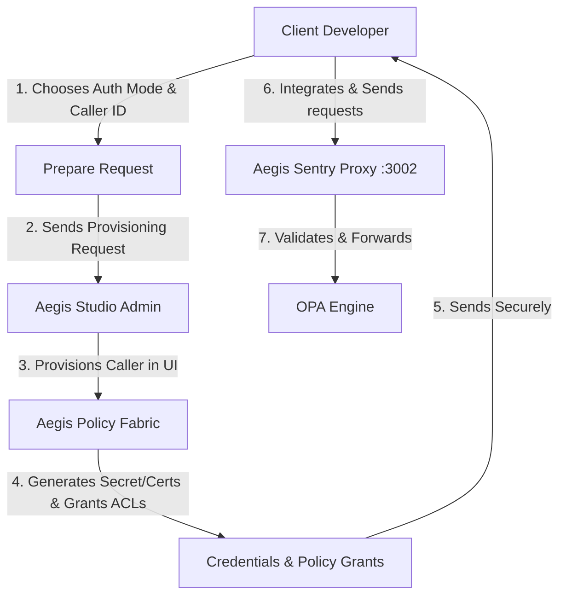
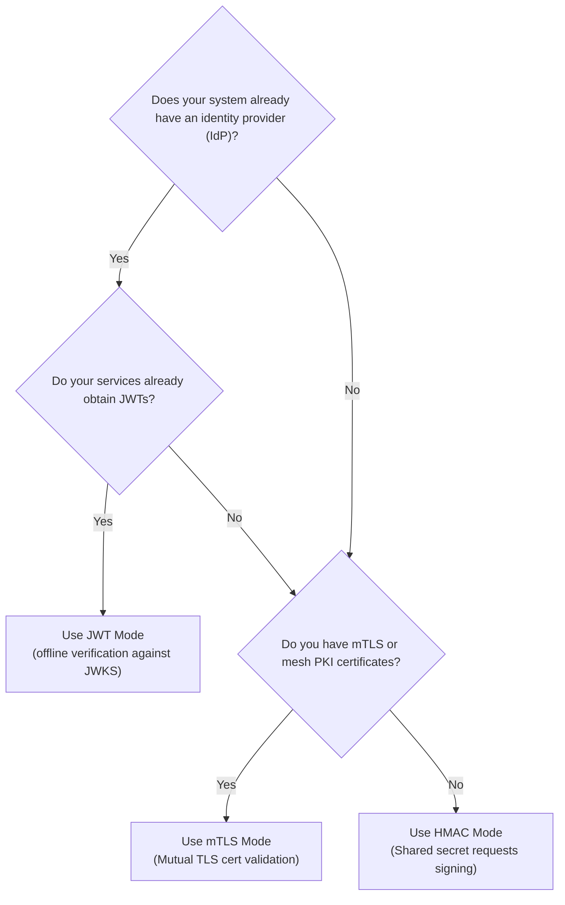
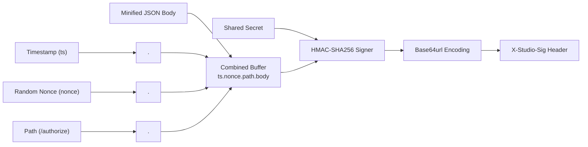
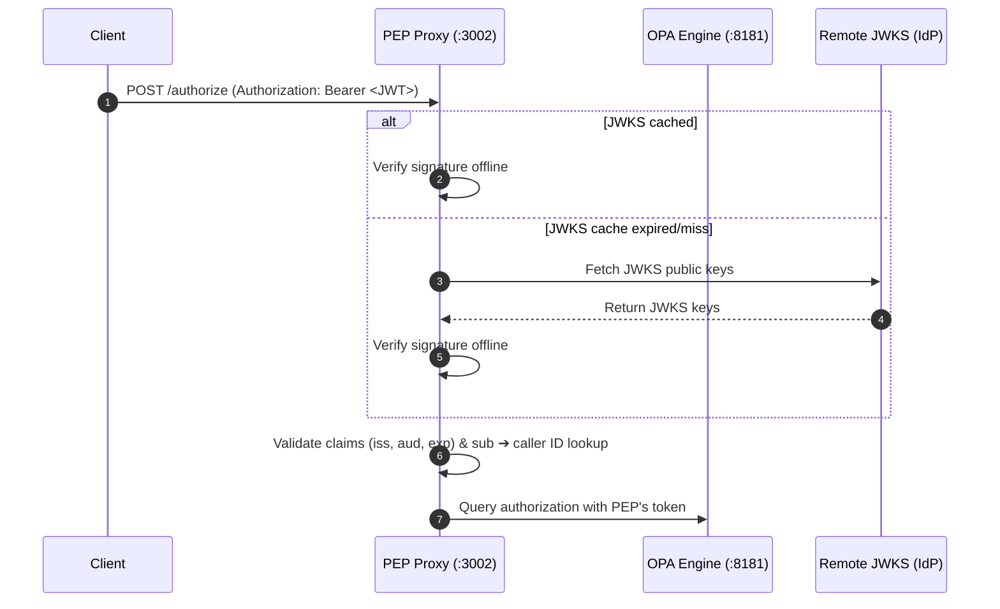
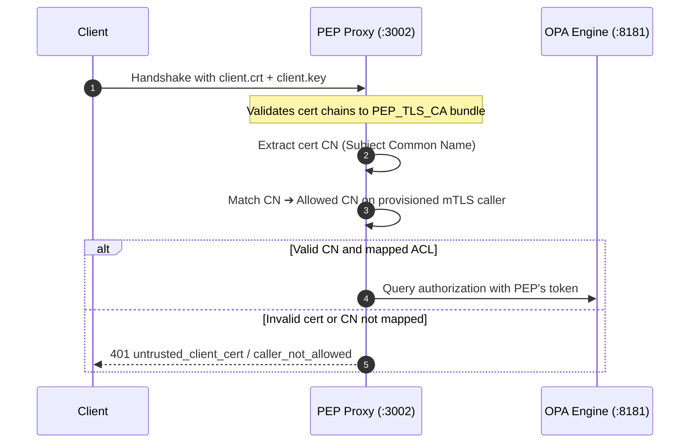
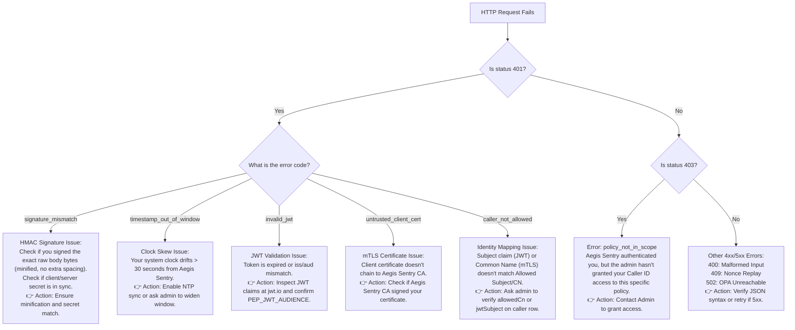

# Aegis Sentry user reference

You're a client developer who wants to call the Aegis Policy Fabric's Aegis Sentry (the Policy Enforcement Point) from your service. You have **no direct access** to Aegis Studio, the OPA server, or the Aegis Sentry host — your only channel is the **Aegis Studio admin**, who provisions you through Aegis Studio.

This guide tells you, in order:

1. What decisions you need to make before contacting the admin.
2. Exactly what to tell and send the admin.
3. What you'll receive back.
4. How to use it to make calls.
5. What to do when something breaks (always: ask the admin).

If you operate Aegis Studio yourself, see [README.md](README.md) — this document is not for you.

---

## 1. What Aegis Sentry is, from your side

Aegis Sentry is an HTTP service. You POST a JSON `input` document to it, naming a policy; it returns an allow/deny decision. You don't talk to OPA, you don't talk to the Aegis Studio database, you don't see other callers. You see exactly three endpoints:



| Endpoint            | Purpose |
|---------------------|---------|
| `POST /authorize`   | Evaluate a named policy against your `input`. Returns `{ allow, reason, result, elapsedMs }`. |
| `POST /discover`    | Given an `input`, return the policies you're allowed to call whose required input paths are satisfied. Use it when you don't know which policy to invoke yet, or to enumerate your scope. |
| `GET  /healthz`     | Liveness probe. No auth required. |

A **policy denial** is HTTP 200 with `allow: false` — your request was authenticated, the policy ran, and the answer was no. Only auth or transport problems produce 4xx/5xx.

> [!NOTE]
> **Multi-Tenant Physical Isolation**
> If your platform operates in a multi-tenant model, policies, OPA engines, and Aegis Sentry PEP instances are physically segregated by organization (tenant). The policies, callers, and trust keys of your organization are compiled into a dedicated organization-scoped bundle (`/bundle/orgs/:orgId/aegis.tar.gz`) pulled dynamically by your dedicated OPA replica(s). Your admin will provide you with the specific Aegis Sentry base URL corresponding to your organization's isolated deployment.

---

## 2. Decisions you must make BEFORE contacting the admin

The admin cannot make these for you. Decide them, then contact them once with everything they need.

### 2.1. Pick your authentication mode

The mode is **immutable** once your caller row is created. Switching later means revoke + re-create — a clean cutover, but extra work. Pick deliberately.



| Mode   | Pick when… | What you have to do |
|--------|-----------|---------------------|
| `hmac` | No PKI, no IdP. You want a shared-secret integration. Typical for external partners or quick internal scripts. | Receive a one-shot secret from the admin and keep it safe. |
| `jwt`  | You already have an IdP (Auth0, Okta, your own SSO) minting JWTs for your services. | Tell the admin your `iss`, `aud`, JWKS URL, and `sub` value. |
| `mtls` | You run inside a service mesh or private network where workloads already have x509 certs. | Generate a keypair + CSR; exchange certificates with the admin. |

### 2.2. Pick a caller ID

A short stable identifier matching `^[A-Za-z0-9_.-]{1,64}$`. It will appear in every audit log entry tied to your calls. Choose something descriptive and stable — e.g. `checkout-svc`, `partner.acme.payments`, `analytics-pipeline`.

### 2.3. Know which policies you need to call

The admin starts you with **zero policy access**. Until they grant your caller access to specific policies, every `/authorize` call returns **403 `policy_not_in_scope`** and `/discover` returns an empty list.

Enumerate the policies you need by name (e.g. `payments/allow`, `risk/score`). If you anticipate needing a whole class (say, everything related to payments), ask the admin to add a **scope tag** to your caller instead — new policies tagged similarly auto-appear in your scope.

For each policy, the admin should also tell you the **`input` shape** it expects.

---

## 3. What to send the admin

Send the admin a single message covering everything below. Adapt the mode-specific block to the mode you picked in §2.1.

### 3.1. Common (every mode)

- **Caller ID** (your choice from §2.2).
- **Auth mode** (`hmac` / `jwt` / `mtls`).
- **Policies you need access to**, by name (or scope tag if requesting a class).
- **Tenant tag** if your platform models tenants and you know yours.
- **Contact channel** for receiving secrets/certs out-of-band (1Password vault, sealed email, etc. — **not** plaintext Slack/email).

And ask the admin to confirm:

- The **Aegis Sentry base URL** (e.g. `https://pep.studio.example.com:3002`).
- The **scheme** (`http://` or `https://` — mTLS forces `https://`).
- The exact **package path** of each policy (the dotted path you'll send in `policy:` — e.g. `payments/allow`).
- The expected `input` **shape** for each policy.

### 3.2. HMAC mode — what to ask for

Ask the admin to:

1. Create your caller row in Aegis Studio with `authMode=hmac` and your chosen caller ID.
2. **Send you the one-shot HMAC secret** through the secure channel you specified. Aegis Studio shows it to the admin exactly once at create time; if they lose it, they must rotate.
3. Grant your caller access to the specific policies you listed.

You will receive:
- The **HMAC secret** (a long base64url string).
- The list of policies you've been granted.

### 3.3. JWT mode — what to send the admin

Two flavours — tell the admin which applies.

**A. The platform mints your tokens.** Common for internal services. Ask the admin to either pin a `jwtSubject` on your row, or leave it blank and use your caller ID as the `sub` claim. Ask them to tell you the `iss` and `aud` to request.

**B. Your own IdP mints the tokens.** Send the admin:

- **JWKS URL** of your IdP (e.g. `https://your-idp.example.com/.well-known/jwks.json`).
- The **`iss`** value your tokens carry.
- The **`aud`** value your tokens carry (or that you'll set when requesting tokens).
- The **`sub`** value your tokens will carry for this service (e.g. `service:checkout`). Ask the admin to pin it on your caller row as `jwtSubject`. If you'd rather not pin, make your tokens carry `sub=<callerId>`.

You will receive (or be told):
- Confirmation that JWT verifier settings are live (`iss`/`aud`/JWKS).
- The list of policies you've been granted.

> Note: changing JWT verifier settings on Aegis Sentry is the **one** admin action that requires an Aegis Sentry restart. If the admin tells you there will be a brief outage during provisioning, that's why.

### 3.4. mTLS mode — what to exchange with the admin

1. Ask the admin for **Aegis Sentry's CA bundle** (`ca.crt`) so you can trust the server cert.
2. Generate your client keypair + CSR with the CN you agree on:
   ```bash
   openssl genrsa -out client.key 4096
   openssl req -new -key client.key -out client.csr -subj '/CN=checkout.svc.acme.com'
   ```
3. **Send the admin `client.csr`** (never `client.key`). They sign it with Aegis Sentry's CA and return `client.crt`.
   *Alternative:* if you run your own CA, send the admin **your CA cert** instead; they add it to Aegis Sentry's trust bundle and accept any of your certs whose CN matches your row.
4. Tell the admin the **CN** to pin (`allowedCn`) on your caller row.

You will receive:
- Aegis Sentry's `ca.crt`.
- Your signed `client.crt`.
- The list of policies you've been granted.

Keep `client.key` private — leaking it is equivalent to leaking an HMAC secret.

---

## 4. What you should have once provisioning is done

Before writing any integration code, confirm with the admin that you have all of the following:

- [ ] **Aegis Sentry base URL** and scheme.
- [ ] **Caller ID** (your value, now provisioned).
- [ ] **Mode-specific material**:
  - HMAC → the secret.
  - JWT → `iss`, `aud`, and either a way to obtain platform-minted tokens or confirmation your IdP is wired up.
  - mTLS → `ca.crt` + your signed `client.crt` (+ your `client.key`).
- [ ] **Policy package paths** for every policy you'll call (e.g. `payments/allow`).
- [ ] **Expected `input` shape** for each policy.
- [ ] **Confirmation of policy access** on your caller — ask the admin to verify on the **Manage access** pane.

If anything in the list is missing, request it before integrating. A missing item costs you a 401/403 and an investigation; asking up-front costs nothing.

---

## 5. Aegis Sentry API surface

### `POST /authorize`

**Request:**
```json
{
  "policy": "payments/allow",
  "input":  { "user": {"id":"u1","tier":"pro"}, "action": "transfer", "amount": 50000 }
}
```

`policy` is the package path the admin gave you. `input` is whatever the policy reads.

**Response on success (200):**
```json
{
  "allow":     true,
  "reason":    "tier_eligible",
  "result":    { "allow": true, "reason": "tier_eligible" },
  "elapsedMs": 7
}
```

`allow` is the canonical boolean. `result` is the raw policy output (may carry extra fields beyond the boolean).

**Response on policy denial (still 200):**
```json
{ "allow": false, "reason": "amount_exceeds_cap", "result": {...}, "elapsedMs": 5 }
```

**Status codes:**

| Status | Meaning |
|--------|---------|
| 200    | Decision (allow or deny). |
| 400    | Malformed request (missing `policy`, `input` not an object, unknown policy path). |
| 401    | Auth failure — see §7. |
| 403    | `policy_not_in_scope` — admin hasn't granted your caller this policy. |
| 409    | Replayed HMAC nonce (`nonce_replay`). Mint a new nonce and retry. |
| 502    | OPA unreachable from Aegis Sentry. |
| 504    | OPA evaluation timed out. |

### `POST /discover`

Returns active policies whose required `input` paths are present.

```bash
curl -XPOST $PEP/discover -H 'content-type: application/json' \
  -d '{"input":{"user":{"tier":"pro"},"amount":50000}}'
```

```json
{
  "mode": "strict",
  "candidates": [
    { "id": "...", "name": "payments-cap", "package": "payments/allow",
      "requiredPaths": ["user.tier", "amount"] }
  ],
  "indexedPolicies": 4,
  "elapsedMs": 2
}
```

`?mode=score` ranks candidates by `matched/required` ratio instead of strict-only.

`?mode=catalog` — pass `{}` as the body to list **every policy your caller is allowed to invoke**, regardless of input. Best way to self-discover your scope after the admin provisions you:

```bash
curl -XPOST "$PEP/discover?mode=catalog" \
  -H "$AUTH_HEADER" -H 'content-type: application/json' -d '{}'
```

If `candidates` comes back empty, the admin hasn't granted you anything yet — go back to §3.

---

## 6. How to call Aegis Sentry, by mode

### 6.1. HMAC

You have: `CALLER`, `SECRET`, `PEP` base URL.

**Signing rule:**



```
sig = base64url( HMAC-SHA256(secret, "ts.nonce.path.body") )
```
where `path` is the request path (e.g. `/authorize`, leading slash, no query string) and `body` is the **exact raw bytes** you POST. Serialize once, sign that buffer, ship that buffer.

**Header:**
```
X-Studio-Sig: caller=<id>,ts=<unix-seconds>,nonce=<random>,sig=<b64url>
```

**Bash:**
```bash
SECRET='...secret-from-admin...'
CALLER='checkout-svc'
PEP='https://pep.studio.example.com:3002'
PATH_='/authorize'
BODY='{"policy":"payments/allow","input":{"user":{"id":"u1","tier":"pro"},"amount":50000}}'

TS=$(date +%s)
NONCE=$(openssl rand -base64 12 | tr '+/' '-_' | tr -d '=')
SIG=$(printf '%s.%s.%s.%s' "$TS" "$NONCE" "$PATH_" "$BODY" \
  | openssl dgst -sha256 -hmac "$SECRET" -binary \
  | base64 | tr '+/' '-_' | tr -d '=')

curl -sS -XPOST "$PEP$PATH_" \
  -H "X-Studio-Sig: caller=$CALLER,ts=$TS,nonce=$NONCE,sig=$SIG" \
  -H 'content-type: application/json' -d "$BODY"
```

**Node.js:**
```js
import { createHmac, randomBytes } from "node:crypto";

const SECRET = process.env.PEP_HMAC_SECRET;
const CALLER = "checkout-svc";
const PEP    = process.env.PEP_URL;

async function pepCall(path, payload) {
  const body  = JSON.stringify(payload);
  const ts    = Math.floor(Date.now() / 1000);
  const nonce = randomBytes(12).toString("base64url");
  const sig   = createHmac("sha256", SECRET)
    .update(`${ts}.${nonce}.${path}.`)
    .update(Buffer.from(body))
    .digest("base64url");

  const res = await fetch(`${PEP}${path}`, {
    method: "POST",
    headers: {
      "content-type": "application/json",
      "X-Studio-Sig": `caller=${CALLER},ts=${ts},nonce=${nonce},sig=${sig}`,
    },
    body,
  });
  if (!res.ok) throw new Error(`PEP ${res.status}: ${await res.text()}`);
  return res.json();
}

// Usage examples:
// const decision = await pepCall("/authorize", { policy: "payments/allow", input: { amount: 50000 } });
// const scope = await pepCall("/discover", { input: { amount: 50000 } });
```

**Python:**
```python
import hmac, hashlib, base64, json, os, secrets, time, requests

SECRET = os.environ["PEP_HMAC_SECRET"].encode()
CALLER = "checkout-svc"
PEP    = os.environ["PEP_URL"]

def pep_call(path, payload):
    body  = json.dumps(payload, separators=(",", ":")).encode()
    ts    = str(int(time.time()))
    nonce = base64.urlsafe_b64encode(secrets.token_bytes(12)).rstrip(b"=").decode()
    msg   = f"{ts}.{nonce}.{path}.".encode() + body
    sig   = base64.urlsafe_b64encode(hmac.new(SECRET, msg, hashlib.sha256).digest()).rstrip(b"=").decode()
    r = requests.post(f"{PEP}{path}", data=body, headers={
        "content-type": "application/json",
        "X-Studio-Sig": f"caller={CALLER},ts={ts},nonce={nonce},sig={sig}",
    })
    r.raise_for_status()
    return r.json()

# Usage examples:
# decision = pep_call("/authorize", {"policy": "payments/allow", "input": {"amount": 50000}})
# scope = pep_call("/discover", {"input": {"amount": 50000}})
```

**HMAC pitfalls (and what to tell the admin if they hit you):**

| Symptom | Cause | What to do |
|---------|-------|------------|
| `signature_mismatch` on every call | You're serializing the body twice (e.g. pretty-print then minify). | Build the body once, sign that exact buffer, send it unchanged. |
| `timestamp_out_of_window` | Your clock drifts > 30 s from the Aegis Sentry host. | Run NTP. If you can't, ask the admin to widen the accepted skew. |
| **409 `nonce_replay`** | Reusing a nonce. | Use a fresh random nonce per request, never a counter. |
| `signature_mismatch` after a working period | Secret rotated by the admin. | Get the new secret from the admin and cut over. |

### 6.2. JWT

You have: a token-issuing IdP (or a way to ask the platform for a token), `CALLER`, `PEP` base URL. The admin has configured Aegis Sentry with your `iss`/`aud`/JWKS.



**Header:**
```
Authorization: Bearer <jwt>
```

**Calling Aegis Sentry (any client):**
```bash
curl -sS -XPOST "$PEP/authorize" \
  -H "Authorization: Bearer $TOKEN" \
  -H 'content-type: application/json' \
  -d '{"policy":"payments/allow","input":{"user":{"id":"u1"},"amount":50000}}'
```

**Node.js with token caching** (your IdP token is reusable until it expires — don't fetch one per request):
```js
let cachedToken = null;

async function getToken() {
  if (cachedToken && cachedToken.exp * 1000 - Date.now() > 60_000) {
    return cachedToken.value;
  }
  const r = await fetch("https://your-idp.example.com/oauth/token", {
    method: "POST",
    headers: { "content-type": "application/x-www-form-urlencoded" },
    body: new URLSearchParams({
      grant_type: "client_credentials",
      client_id: process.env.IDP_CLIENT_ID,
      client_secret: process.env.IDP_CLIENT_SECRET,
      audience: "pep",
    }),
  });
  const { access_token, expires_in } = await r.json();
  cachedToken = { value: access_token, exp: Math.floor(Date.now()/1000) + expires_in };
  return access_token;
}
```

**JWT pitfalls:**

| Symptom | Cause | What to do |
|---------|-------|------------|
| `invalid_jwt` immediately | `iss` / `aud` don't match what the admin configured, or token expired. | Confirm with the admin what values they set; refresh the token. |
| `caller_not_allowed` | Your token's `sub` doesn't match `jwtSubject` on your row (or your `callerId`, if not pinned). | Ask the admin which `sub` your row is pinned to. |
| `mode_not_configured` | The admin hasn't wired JWT verifier settings on Aegis Sentry yet. | Ask them to finish provisioning (and restart Aegis Sentry). |

### 6.3. mTLS

You have: `client.crt`, `client.key`, `ca.crt`, `PEP` base URL (https).



**curl:**
```bash
curl -sS --cacert ca.crt --cert client.crt --key client.key \
  -XPOST "$PEP/authorize" \
  -H 'content-type: application/json' \
  -d '{"policy":"payments/allow","input":{"user":{"id":"u1"},"amount":50000}}'
```

**Node.js (`undici`):**
```js
import { Agent, fetch } from "undici";
import { readFileSync } from "node:fs";

const agent = new Agent({
  connect: {
    ca:   readFileSync("ca.crt"),
    cert: readFileSync("client.crt"),
    key:  readFileSync("client.key"),
  },
});

async function authorize(policy, input) {
  const r = await fetch(`${process.env.PEP_URL}/authorize`, {
    method: "POST",
    dispatcher: agent,
    headers: { "content-type": "application/json" },
    body: JSON.stringify({ policy, input }),
  });
  if (!r.ok) throw new Error(`PEP ${r.status}: ${await r.text()}`);
  return r.json();
}
```

**Python (`requests`):**
```python
import requests
r = requests.post(
    f"{PEP}/authorize",
    json={"policy": "payments/allow", "input": {"user": {"id": "u1"}, "amount": 50000}},
    verify="ca.crt",
    cert=("client.crt", "client.key"),
)
r.raise_for_status()
```

**mTLS pitfalls:**

| Symptom | Cause | What to do |
|---------|-------|------------|
| TLS handshake error | The Aegis Sentry hostname isn't in the server cert's SAN. | Use the hostname the admin gave you, or fix DNS. |
| `untrusted_client_cert` | Your CA isn't in Aegis Sentry's trust bundle. | Either send the admin a CSR (let them sign), or send them your CA cert to add to the bundle. |
| `caller_not_allowed` | Your cert's CN doesn't match `allowedCn` on your row. | Ask the admin which CN they pinned; re-issue with that CN. |
| `client_cert_missing_cn` | Your cert was issued without a CN on the subject. | Re-issue the cert with a proper CN. |

---

## 7. Error reference

All auth failures return `{"error":"<code>", ...}`. HTTP status is **401** unless noted.

### Visual Troubleshooting Tree




> [!WARNING]
> **Authentication vs. Policy Decision**: 
> - A `200 OK` response with `"allow": false` means your credentials were correct, but the deployed policy rules actively denied access based on your `input` values.
> - A `4xx` or `5xx` error code indicates that the caller could not be authenticated, authorization check failed, or there was a system transport failure. Do not retry `4xx` errors without changing credentials/inputs.

| Error code               | What it means | What to do |
|--------------------------|---------------|------------|
| `no_credentials`         | You sent no credential. | Send the credential matching your mode. |
| `ambiguous_credentials`  | You sent more than one kind of credential. | Send only the one your mode expects. |
| `auth_mode_mismatch`     | Credential kind ≠ your row's mode. | Use the mode the admin provisioned you for. |
| `mode_not_configured`    | (JWT) Aegis Sentry not yet configured for JWT verification. | Ask the admin to finish provisioning. |
| `unknown_caller`         | (HMAC) `caller` value isn't a known row. | Confirm your caller ID with the admin; you may have been revoked. |
| `caller_not_allowed`     | (JWT) `sub` doesn't resolve; or (mTLS) CN not pinned. | Confirm the value the admin pinned. |
| `signature_mismatch`     | (HMAC) Bad signature. | Check secret, body bytes, exact path. |
| `timestamp_out_of_window`| (HMAC) Clock skew too large. | Sync clocks (NTP). |
| `nonce_replay` (**409**) | (HMAC) Nonce reused recently. | Use a new random nonce per request. |
| `missing_or_malformed_signature` | (HMAC) Missing or malformed `X-Studio-Sig` header. | Check header presence and that format is comma-separated `key=val`. |
| `invalid_timestamp`      | (HMAC) The `ts` parameter is not a valid Unix timestamp. | Verify the `ts` format is a valid integer in seconds. |
| `invalid_signature_encoding` | (HMAC) Signature encoding is invalid (not base64url). | Ensure `sig` is base64url encoded without padding. |
| `caller_misconfigured`   | (HMAC) Caller row exists but lacks an `hmac_secret`. | Ask the admin to regenerate/verify your HMAC secret. |
| `missing_bearer_token`   | (JWT) Missing or malformed `Authorization` Bearer token. | Ensure the `Authorization` header is sent as 'Bearer <token>'. |
| `jwt_missing_sub`        | (JWT) Token is verified but missing a `sub` (subject) claim. | Configure your Identity Provider to include the `sub` claim in the minted JWT. |
| `invalid_jwt`            | (JWT) Bad signature, wrong `iss`/`aud`, or expired. | Check `reason` field; refresh token. |
| `client_cert_required`   | (mTLS) No client cert presented. | Pass `--cert`/`--key` (or equivalent). |
| `untrusted_client_cert`  | (mTLS) Cert doesn't chain to Aegis Sentry's trust bundle. | Get the admin to sign your CSR or add your CA. |
| `client_cert_missing_cn` | (mTLS) Cert has no CN. | Re-issue with a CN. |
| `policy_not_in_scope` (**403**) | Your caller isn't granted access to this policy. | Ask the admin to grant it via the **Manage access** pane. |
| `acl_lookup_failed` (**502**) | Transient: Aegis Sentry couldn't load the access list. | Retry; resolves on next refresh. |

A 200 with `allow: false` is **the policy's decision**, not an auth error. If you expected `allow: true`, the issue is the policy logic or your `input` — work with the admin to inspect the policy in the Aegis Studio sandbox.

---

## 8. Operational topics (what to ask the admin for)

### Rotation

- **HMAC**: ask the admin to **Rotate** your row. They send the new secret out-of-band; cut over with a brief overlap (hold both, retry with the new one, then drop the old).
- **JWT**: nothing for you to do for normal token expiry — your IdP handles it. If your IdP rotates its signing keys, Aegis Sentry's JWKS cache picks it up automatically.
- **mTLS**: when your cert nears expiry, generate a new CSR (same CN) and send it to the admin. They return a new `client.crt`; redeploy.

### Revocation

If you suspect your secret/cert is compromised, **tell the admin immediately** and ask them to revoke your row. Revocation propagates to Aegis Sentry within ~30 s. After revoke they can issue you a fresh row, but the same caller ID cannot be reused while the old row is in revoked-state — agree a new ID, or wait until the old row is deleted.

### Asking for more policies

Send the admin a list of additional policy package paths. New grants are immediate — no restart, no new credentials. If you anticipate the list growing repeatedly, ask the admin to apply a **scope tag** to your caller so future tagged policies are auto-granted.

### What to monitor on your side

- `/authorize` latency (p50/p99). Aegis Sentry itself adds < 10 ms in practice — anything higher is OPA, the network, or your IdP.
- 4xx rate. A sudden spike usually means revocation, missed rotation, or clock drift — ask the admin to check audit logs for your caller.
- Token cache hit rate (JWT mode). If you're fetching a fresh token per call, you're rate-limiting your own IdP.

### What the admin sees

Every decision is logged against your caller ID (HMAC/mTLS) or JWT `sub` (JWT). If you need to debug a specific call, give the admin: timestamp, caller ID, policy path, and the `elapsedMs` if you have it. They can find it in the audit log.

---

## 9. End-to-end checklist

Before you write integration code:

- [ ] Mode decided (§2.1).
- [ ] Caller ID decided (§2.2).
- [ ] Policy list (or scope tag) prepared (§2.3).
- [ ] Single provisioning request sent to the admin (§3).
- [ ] Received back all of: Aegis Sentry URL + scheme, mode material (secret / IdP confirmation / certs), policy paths, expected `input` shapes, confirmation of policy grants (§4).
- [ ] One smoke-test call works end-to-end (copy a snippet from §6, expect a 200 with `allow: true` or `allow: false`).
- [ ] Integration code handles auth errors (§7) and uses idempotent retries on 5xx, **no retries** on 4xx without changing inputs.
