# Aegis Policy Fabric

A visual builder that compiles JSON policy specs to Rego, deploys them to OPA, signs every mutation into a tamper-evident audit chain, and serves the resulting decisions through a generic Aegis Sentry (the Policy Enforcement Point). Aegis Policy Fabric targets a single laptop via `docker compose` and the same images deploy unchanged on Kubernetes — cryptographic dependencies (KMS, IdP, trust roots, log sink) swap through BYO adapters, never a code change.

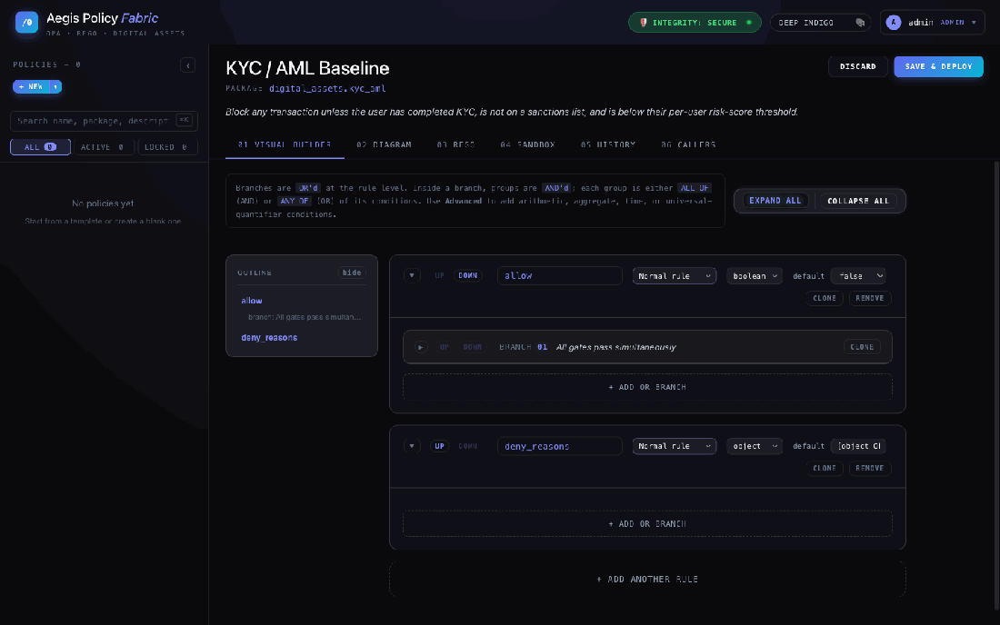

> **Aegis Studio in motion** — the same policy stepped through the Visual Builder, the Flow Tracer diagram, the compiled Rego, and the live Sandbox. Every screenshot below is captured from the running stack.

## System Architecture

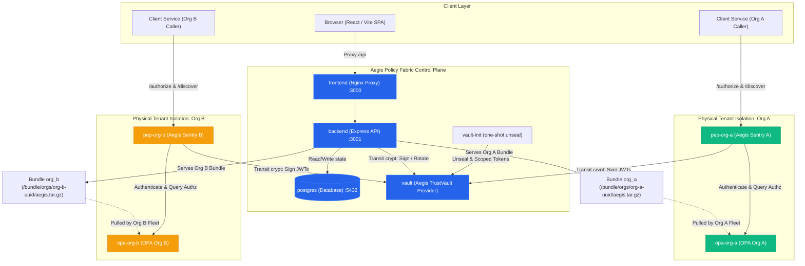
```mermaid
flowchart TB
    subgraph Client ["Client Layer"]
        browser["Browser (React / Vite SPA)"]
        caller_a["Client Service (Org A Caller)"]
        caller_b["Client Service (Org B Caller)"]
    end

    subgraph Studio ["Aegis Policy Fabric Control Plane"]
        frontend["frontend (Nginx Proxy) :3000"]
        backend["backend (Express API) :3001"]
        postgres[("postgres (Database) :5432")]
        vault["vault (Aegis TrustVault Provider)"]
        vault_init["vault-init (one-shot unseal)"]
    end

    subgraph TenantA ["Physical Tenant Isolation: Org A"]
        pep_a["pep-org-a (Aegis Sentry A)"]
        opa_a["opa-org-a (OPA Org A)"]
    end

    subgraph TenantB ["Physical Tenant Isolation: Org B"]
        pep_b["pep-org-b (Aegis Sentry B)"]
        opa_b["opa-org-b (OPA Org B)"]
    end

    browser -->|Proxy /api| frontend
    frontend --> backend
    backend -->|Read/Write state| postgres
    backend -->|Transit crypt: Sign / Rotate| vault
    vault_init -->|Unseal & Scoped Tokens| vault

    %% Tenant A Bundle & Flow
    backend -->|Serves Org A Bundle| bundle_a["Bundle org_a<br/>(/bundle/orgs/org-a-uuid/aegis.tar.gz)"]
    bundle_a -.->|Pulled by Org A Fleet| opa_a
    caller_a -->|/authorize & /discover| pep_a
    pep_a -->|Authenticate & Query Authz| opa_a
    pep_a -->|Transit crypt: Sign JWTs| vault

    %% Tenant B Bundle & Flow
    backend -->|Serves Org B Bundle| bundle_b["Bundle org_b<br/>(/bundle/orgs/org-b-uuid/aegis.tar.gz)"]
    bundle_b -.->|Pulled by Org B Fleet| opa_b
    caller_b -->|/authorize & /discover| pep_b
    pep_b -->|Authenticate & Query Authz| opa_b
    pep_b -->|Transit crypt: Sign JWTs| vault

    classDef control fill:#2563eb,stroke:#3b82f6,color:#fff
    classDef tenantA fill:#10b981,stroke:#059669,color:#fff
    classDef tenantB fill:#f59e0b,stroke:#d97706,color:#fff
    
    class backend,postgres,vault,frontend control
    class pep_a,opa_a tenantA
    class pep_b,opa_b tenantB
```

## Services

| Service      | Port            | What it does                                                                                          |
|--------------|-----------------|-------------------------------------------------------------------------------------------------------|
| `frontend`   | 3000 → nginx:80 | React/Vite SPA. The Visual Builder, Sandbox, audit viewer, and admin pages. Proxies `/api` → backend. |
| `backend`    | 3001            | Aegis Core Express API. Compiles specs → Rego, manages users / policies / trust keys / Aegis Sentry callers, signs the audit chain via Aegis TrustVault. |
| `pep`        | 3002            | Aegis Sentry. Stateless `/authorize` + `/discover`. Authenticates callers (mTLS / HMAC / JWT) and forwards `input` to OPA. |
| `opa`        | 8181            | Policy engine. Boots with only `opa/config.yaml` and **pulls** a bundle (policies + data + authz Rego + `platform_keys`) from the backend's `/bundle/aegis.tar.gz` (global) or `/bundle/orgs/:orgId/aegis.tar.gz` (tenant-scoped) endpoint. Gated by `system_authz` (EdDSA JWT per request) and consulted via `studio_authz` on mutating routes. Stateless — run as many replicas as you like; they all converge on their respective bundle. |
| `postgres`   | 5433 → 5432     | Users, orgs, roles, policies, versions, audit log, trust keys, Aegis Sentry callers. |
| `vault`      | (internal)      | Default Aegis TrustVault provider. Holds the Ed25519 audit-signing key in Transit; the private key never leaves it. |
| `vault-init` | (one-shot)      | Initialises Vault on first boot, mints the scoped signer tokens (`backend_token`, `pep_token`), and generates the `opa_bundle_token` shared secret OPA uses to pull the bundle. |

The compiler is the security boundary: every condition in a JSON spec is validated against per-op whitelists, then rendered into Rego v1. User-authored specs cannot produce arbitrary Rego. The audit chain is hash-linked + Ed25519-signed; if the chain breaks, `studio.authz` freezes all mutations.

## Bootstrap sequence

What happens on `docker compose up` — no shared secrets, all signing material minted on demand inside Vault.

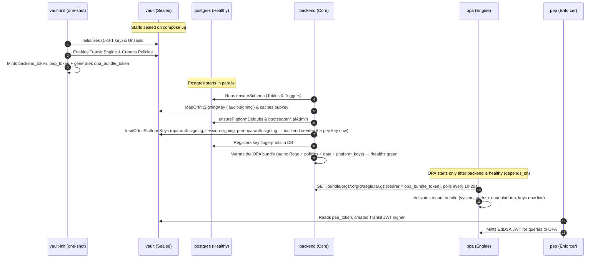
```mermaid
sequenceDiagram
    autonumber
    participant VaultInit as vault-init (one-shot)
    participant Vault as vault (Sealed)
    participant DB as postgres (Healthy)
    participant Backend as backend (Core)
    participant OPA as opa (Engine)
    participant PEP as pep (Enforcer)

    Note over Vault: Starts sealed on compose up
    VaultInit->>Vault: Initialises (1-of-1 key) & Unseals
    VaultInit->>Vault: Enables Transit Engine & Creates Policies
    VaultInit->>VaultInit: Mints backend_token, pep_token + generates opa_bundle_token

    Note over DB: Postgres starts in parallel

    Backend->>DB: Runs ensureSchema (Tables & Triggers)
    Backend->>Vault: loadOrInitSigningKey ('audit-signing') & caches pubkey
    Backend->>DB: ensurePlatformDefaults & bootstrapInitialAdmin
    Backend->>Vault: loadOrInitPlatformKeys (opa-auth-signing, session-signing, pep-opa-auth-signing — backend creates the pep key now)
    Backend->>DB: Registers key fingerprints in DB
    Backend->>Backend: Warms the OPA bundle (authz Rego + policies + data + platform_keys) → /healthz green

    Note over OPA: OPA starts only after backend is healthy (depends_on)
    OPA->>Backend: GET /bundle/orgs/:orgId/aegis.tar.gz (bearer = opa_bundle_token), polls every 10-20s
    OPA->>OPA: Activates tenant bundle (system_authz + data.platform_keys now live)

    PEP->>Vault: Reads pep_token, creates Transit JWT signer
    PEP->>OPA: Mints EdDSA JWT for queries to OPA
```

> [!IMPORTANT]
> **The compiler is the absolute security boundary**: Visual specs are statically validated against allowed whitelists before being converted to Rego v1. User-authored specs can never escape the visual compiler's boundary.

1. **`vault`** starts sealed.
2. **`vault-init`** (sidecar) runs against `vault`:
   - initialises Vault (1-of-1 unseal share → `init.json`), unseals, enables the Transit secrets engine.
   - writes least-privilege policies and mints one scoped token per consumer:
     - `backend_token` → sign with `audit-signing` + `opa-auth-signing*` + `session-signing*`; **read+update** (create/rotate, never sign) on `pep-opa-auth-signing*`.
     - `pep_token` → sign-only on `pep-opa-auth-signing*`.
   - generates `opa_bundle_token` (mode 0644) — the bearer OPA presents to the backend's `/bundle` endpoint.
3. **`postgres`** starts in parallel and becomes healthy.
4. *(removed)* — there is no `opa-trust-init` sidecar anymore. The backend creates the `opa-auth-signing` and `pep-opa-auth-signing` keys itself (`loadOrInitPlatformKeys`) and folds their pubkeys into the bundle as `data.platform_keys`.
5. **`backend`** must be healthy before `opa` starts (inverted `depends_on`). `system_authz.rego`, `studio_authz.rego`, and `data.platform_keys` all travel in the bundle the backend serves — see step 6.
6. **`backend`** starts and, in order:
   - `ensureSchema` (Postgres tables + audit-session trigger).
   - `audit.loadOrInitSigningKey` (creates / reconciles `audit-signing` in Vault, caches pubkey).
   - `ensurePlatformDefaults` (idempotent): seeds the default `platform` org + five built-in roles (`root`, `org_admin`, `policy_author`, `auditor`, `viewer`); promotes any pre-RBAC `role='admin'` users to `is_root` and pins them to `platform`.
   - `bootstrapInitialAdmin` (creates admin user pinned to `platform` org + `root` role + signed **genesis** audit row inside one transaction). Banner prints credentials, org, and role.
   - `platformKeys.loadOrInitPlatformKeys` (creates / reconciles `opa-auth-signing`, `session-signing`, `pep-opa-auth-signing` in Vault, registers their fingerprints in `platform_signing_keys` via `withAudit`).
   - cross-checks Vault pubkey ↔ DB row; mismatch sets `trustBroken` and `studio.authz` freezes mutations.
   - **warms the OPA bundle** (`opaBundle.buildBundle`: authz Rego + active policies + `data.studio.policy_index` / `studio.keys` / `studio.callers` / `studio.caller_access` / `platform_keys` dynamically scoped by organization), flips `/healthz` to ready, starts the JWKS fetcher. Every later mutation just `invalidateBundle`s the specific organization cache; the next OPA poll rebuilds.
7. **`opa`** starts (only now that `backend` is healthy), boots from `opa/config.yaml`, and pulls its bundle from `GET /bundle/orgs/:orgId/aegis.tar.gz` (or `/bundle/aegis.tar.gz` fallback) with `opa_bundle_token`. 
   - **Local Tenant Replication / Compose Deployment**: OPA config supports environment variable substitution (`resource: ${OPA_BUNDLE_PATH:-/bundle/aegis.tar.gz}`). To deploy an isolated physical OPA container for a tenant, operators can run another OPA container (or uncomment the template `opa-tenant-example` in `docker-compose.yml`), mapping `OPA_BUNDLE_PATH=/bundle/orgs/<org-id>/aegis.tar.gz`.
   - Until the first bundle activates, `--authorization=basic` is fail-closed (denies all). Replicas re-poll every 10-20s (ETag/304) and converge on their configured bundle revision.
8. **`pep`** starts, reads `pep_token`, creates a Vault-backed signer for `pep-opa-auth-signing`, mints a fresh EdDSA JWT (aud=`opa-studio-pep`) per request to OPA — system_authz restricts the Aegis Sentry aud to read-only paths.
9. **`frontend`** starts last, serves the SPA on `:3000` and proxies `/api` to backend.

Key model — four KMS-held Ed25519 keys, distinct purposes, separate blast radii:

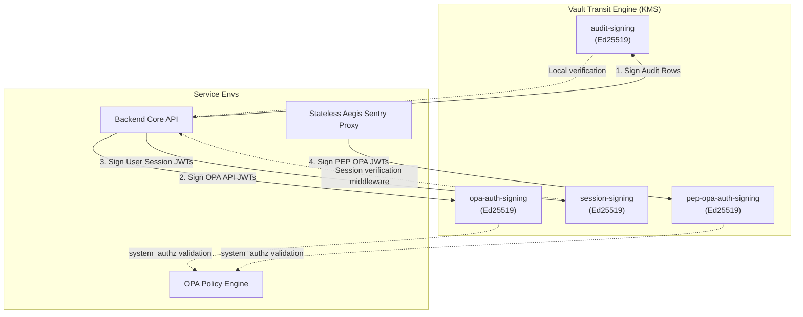
```mermaid
flowchart TD
    subgraph VaultTransit ["Vault Transit Engine (KMS)"]
        audit_key["audit-signing<br/>(Ed25519)"]
        opa_auth_key["opa-auth-signing<br/>(Ed25519)"]
        session_key["session-signing<br/>(Ed25519)"]
        pep_auth_key["pep-opa-auth-signing<br/>(Ed25519)"]
    end

    subgraph Services ["Service Envs"]
        BackendService["Backend Core API"]
        PepService["Stateless Aegis Sentry Proxy"]
        OpaEngine["OPA Policy Engine"]
    end

    BackendService -->|1. Sign Audit Rows| audit_key
    BackendService -->|2. Sign OPA API JWTs| opa_auth_key
    BackendService -->|3. Sign User Session JWTs| session_key
    PepService -->|4. Sign PEP OPA JWTs| pep_auth_key

    audit_key -.->|Local verification| BackendService
    opa_auth_key -.->|system_authz validation| OpaEngine
    session_key -.->|Session verification middleware| BackendService
    pep_auth_key -.->|system_authz validation| OpaEngine
```

| Key | Signer | Verifier | Aud | Description / Blast Radius |
|-----|--------|----------|-----|----------------------------|
| `audit-signing` | backend (audit chain) | backend (local, against `audit_signing_keys.pubkey`) | — | Tamper-evident ledger integrity. Compromise allows forging audit logs. |
| `opa-auth-signing` | backend (every OPA call) | OPA (`system_authz`) | `opa-studio-backend` | Core OPA mutations. Compromise allows modifying policy engine state. |
| `session-signing` | backend (user-session JWTs) | backend `authenticate` middleware | `opa-policy-studio-session` | User sessions. Compromise allows spoofing user dashboard actions. |
| `pep-opa-auth-signing` | pep (every OPA call) | OPA (`system_authz`) | `opa-studio-pep` (reads only) | Aegis Sentry query validation. Compromise allows spoofing read-only OPA requests. |

Rotation goes through `POST /api/platform-keys/rotate`: Vault Transit native versioning (same keyId, bumped version), publish-then-flip ordering so OPA learns the new pubkey before backend signs with it; previous version stays `retired` until `POST /api/platform-keys/:fp/revoke`.

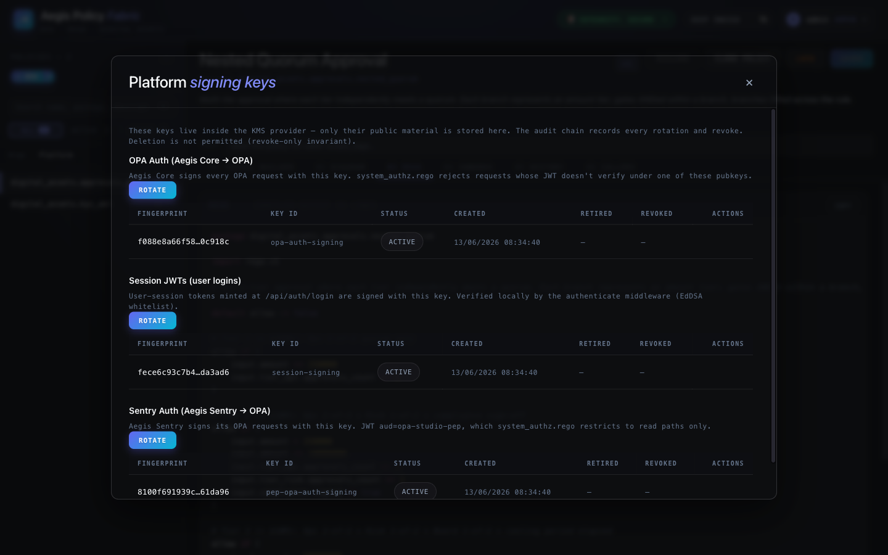

> The **Platform keys** admin surface: only public material + lifecycle state are stored here — the private keys never leave the KMS provider.

## Database Architecture & Data Model

Aegis Policy Fabric uses a PostgreSQL database to manage state across identity, roles, policy cataloging, Aegis Sentry integrations, cryptographic trust roots, and tamper-evident audit logs.

### Entity-Relationship (ER) Diagram

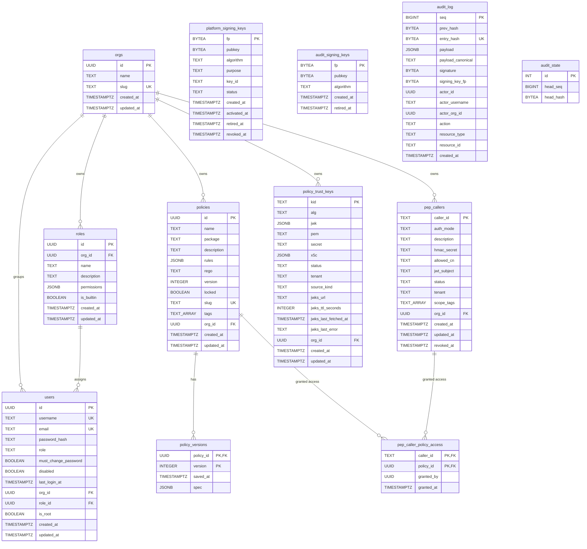
```mermaid
erDiagram
    orgs {
        UUID id PK
        TEXT name
        TEXT slug UK
        TIMESTAMPTZ created_at
        TIMESTAMPTZ updated_at
    }
    roles {
        UUID id PK
        UUID org_id FK
        TEXT name
        TEXT description
        JSONB permissions
        BOOLEAN is_builtin
        TIMESTAMPTZ created_at
        TIMESTAMPTZ updated_at
    }
    users {
        UUID id PK
        TEXT username UK
        TEXT email UK
        TEXT password_hash
        TEXT role
        BOOLEAN must_change_password
        BOOLEAN disabled
        TIMESTAMPTZ last_login_at
        UUID org_id FK
        UUID role_id FK
        BOOLEAN is_root
        TIMESTAMPTZ created_at
        TIMESTAMPTZ updated_at
    }
    policies {
        UUID id PK
        TEXT name
        TEXT package
        TEXT description
        JSONB rules
        TEXT rego
        INTEGER version
        BOOLEAN locked
        TEXT slug UK
        TEXT_ARRAY tags
        UUID org_id FK
        TIMESTAMPTZ created_at
        TIMESTAMPTZ updated_at
    }
    policy_versions {
        UUID policy_id PK, FK
        INTEGER version PK
        TIMESTAMPTZ saved_at
        JSONB spec
    }
    pep_callers {
        TEXT caller_id PK
        TEXT auth_mode
        TEXT description
        TEXT hmac_secret
        TEXT allowed_cn
        TEXT jwt_subject
        TEXT status
        TEXT tenant
        TEXT_ARRAY scope_tags
        UUID org_id FK
        TIMESTAMPTZ created_at
        TIMESTAMPTZ updated_at
        TIMESTAMPTZ revoked_at
    }
    pep_caller_policy_access {
        TEXT caller_id PK, FK
        UUID policy_id PK, FK
        UUID granted_by
        TIMESTAMPTZ granted_at
    }
    policy_trust_keys {
        TEXT kid PK
        TEXT alg
        JSONB jwk
        TEXT pem
        TEXT secret
        JSONB x5c
        TEXT status
        TEXT tenant
        TEXT source_kind
        TEXT jwks_url
        INTEGER jwks_ttl_seconds
        TIMESTAMPTZ jwks_last_fetched_at
        TEXT jwks_last_error
        UUID org_id FK
        TIMESTAMPTZ created_at
        TIMESTAMPTZ updated_at
    }
    platform_signing_keys {
        BYTEA fp PK
        BYTEA pubkey
        TEXT algorithm
        TEXT purpose
        TEXT key_id
        TEXT status
        TIMESTAMPTZ created_at
        TIMESTAMPTZ activated_at
        TIMESTAMPTZ retired_at
        TIMESTAMPTZ revoked_at
    }
    audit_signing_keys {
        BYTEA fp PK
        BYTEA pubkey
        TEXT algorithm
        TIMESTAMPTZ created_at
        TIMESTAMPTZ retired_at
    }
    audit_log {
        BIGINT seq PK
        BYTEA prev_hash
        BYTEA entry_hash UK
        JSONB payload
        TEXT payload_canonical
        BYTEA signature
        BYTEA signing_key_fp
        UUID actor_id
        TEXT actor_username
        UUID actor_org_id
        TEXT action
        TEXT resource_type
        TEXT resource_id
        TIMESTAMPTZ created_at
    }
    audit_state {
        INT id PK
        BIGINT head_seq
        BYTEA head_hash
    }

    orgs ||--o{ roles : "owns"
    orgs ||--o{ users : "groups"
    orgs ||--o{ policies : "owns"
    orgs ||--o{ pep_callers : "owns"
    orgs ||--o{ policy_trust_keys : "owns"
    roles ||--o{ users : "assigns"
    policies ||--o{ policy_versions : "has"
    policies ||--o{ pep_caller_policy_access : "granted access"
    pep_callers ||--o{ pep_caller_policy_access : "granted access"
```

### Table Definitions & Data Dictionary

#### 1. Identity & Tenant Organization
* **`orgs`**: Models tenant organizations (flat multi-tenancy). The system initializes a default `platform` organization for root-level operations.
* **`roles`**: Permissions matrix table (`action` × `resource_type`) stored in a `JSONB` document. Features unique naming indexes ensuring no name collisions globally or tenant-locally.
* **`users`**: Platform administrative accounts. Supports password hashing, password expiry/change prompts, and mapping to organizations and roles.

#### 2. Policy Cataloging & Versioning
* **`policies`**: Holds policy metadata, visual rule spec structures in `JSONB`, compiled Rego v1 code, locking statuses, and tags.
* **`policy_versions`**: Maintains a rolling historical snapshot (up to 50 versions per policy) of rule specifications for instant diffing and rollback capability.

#### 3. Aegis Sentry (Policy Enforcement Point) Integration
* **`pep_callers`**: Contains credential definitions (`auth_mode`: `hmac`, `mtls`, `jwt`) permitted to access the Aegis Sentry proxy. Enforces unique mTLS Common Names (CN) and redacted secrets out-of-the-box.
* **`pep_caller_policy_access`**: Direct M:N mapping of which caller identities are granted authorization to execute specific policy targets (binary grants).

#### 4. Cryptographic Key Management & Trust
* **`policy_trust_keys`**: Manages inline PEM keys, raw secrets, and Okta/Auth0 remote `jwks_url` endpoints. The background worker refreshes JWKS URLs and publishes changes automatically to OPA at `data.studio.keys`.
* **`platform_signing_keys`**: Vault Transit-backed platform keys used to authorize queries between Aegis Sentry and OPA.
* **`audit_signing_keys`**: Stores fingerprints and public keys of transit audit-signing keys to preserve verification capability across rotations.

#### 5. Tamper-Evident Audit Chain Ledger
* **`audit_log`**: Contains the sequence of tamper-evident log rows. Each entry contains cryptographic `prev_hash` linkages and an Ed25519 signature verified locally.
* **`audit_state`**: A singleton table recording the current tail of the hash chain (`head_seq`, `head_hash`).

---

### Security Mechanisms & Invariants

> [!IMPORTANT]
> **Database Trigger Protection (Defense-in-Depth)**
> To prevent direct, unauthorized, or out-of-band writes to the database (e.g. bypass attacks from raw PSQL), a statement-level `BEFORE` trigger `_opa_studio_require_audit_session` is installed on **all 12 tables**.
> 
> Any `INSERT`, `UPDATE`, or `DELETE` statement must occur within an Express transaction that actively declares a session marker:
> ```sql
> SELECT set_config('opa_studio.audit_session', 'on', true);
> ```
> Unmarked writes raise database exception `P0001` and are rolled back immediately. This ensures that every mutating database operation is captured inside the cryptographically signed audit chain via `withAudit()`.

---

## Bundled templates

Picked from the **New policy** flow in the UI; sources live under [backend/src/templates/](backend/src/templates/).

- **trustedAuth** — JWT-gated decisions exercising the new `verify` condition and the trust store: single-tenant gate, multi-tenant dynamic kid, tiered amount cap.
- **digitalAssets** — KYC/AML, sanctions, stablecoin mint/redeem, treasury, RBAC, quorum.
- **custodyHierarchy** — onboarding request, quorum approval, legal-entity / business-unit / portfolio scoping.
- **saasMultitenant** — tenant isolation, domain gating, access-violation detection, org sharing.

---

## Quick start

> [!TIP]
> **Zero configuration required**: All signing and cryptographic materials are dynamically generated inside the default Aegis TrustVault provider (HashiCorp Vault) during first boot.

```bash
cp .env.example .env
# No required secrets to fill — all signing material is minted lazily inside
# the KMS provider (Vault by default) on first boot.

docker compose up --build
docker compose logs -f backend                   # find the bootstrap banner
```

The first-boot banner in `backend` logs prints:
- the initial admin username (default `admin`) and a generated password,
- the audit-signing pubkey fingerprint + Aegis TrustVault provider label (e.g. `vault://transit/audit-signing`).

> [!IMPORTANT]
> The default password is also written to `/data/initial_admin_password` inside the backend container and is **automatically deleted** once the admin completes their forced password change.

Open <http://localhost:3000>, log in, and change the password immediately.

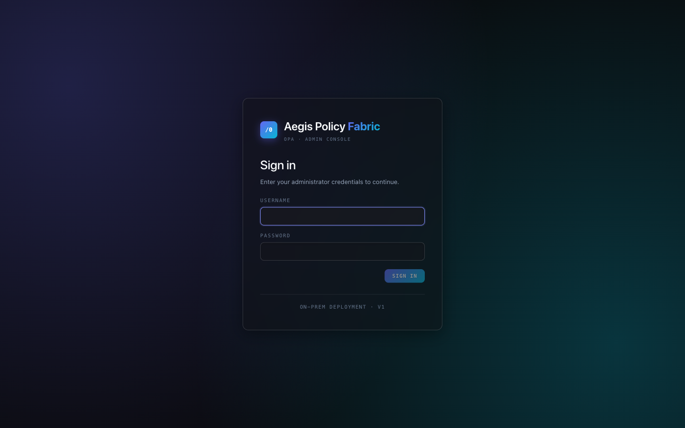

### Sanity checks

```bash
# OPA reachable (system_authz.rego allowlists /health — no token required)
curl http://localhost:8181/health

# Audit chain end-to-end verification (counts checked signatures)
curl -H "Authorization: Bearer <admin JWT>" http://localhost:3001/api/audit/verify

# PEP discovery — works credential-less with PEP_DEV_ALLOW_ANON=true
# (the laptop default). In prod the dispatcher requires a valid hmac / jwt
# / mtls credential matching a provisioned pep_callers row.
curl -XPOST http://localhost:3002/discover \
  -H 'content-type: application/json' \
  -d '{"input":{"user":{"tier":"pro"},"amount":50000}}'
```

---

## Tour of the UI

After login, the admin interface presents a state-of-the-art developer workspace with robust navigational and debugging tools:

Every policy starts from the **Template Gallery** — dozens of pre-wired specs across compliance, custody, DeFi, multi-tenancy, and cryptographic-auth categories:

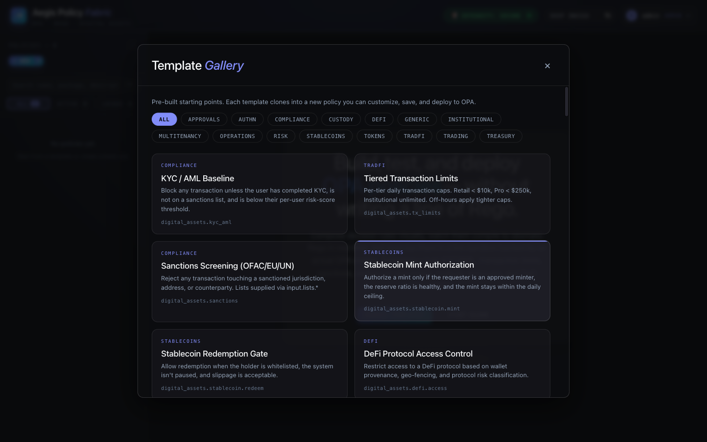

- **High-Scale Sidebar Drill-Down**: A high-capacity tree nested by `Org ➔ Package ➔ Policy` that supports pagination, instant hover duplication/cloning, and a `⌘K` or `Ctrl+K` global search override to instantly bypass the visual hierarchy.

  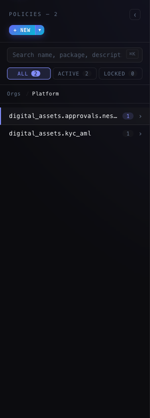
- **Policy Editor** with six highly-interactive tabs (the sixth, **Callers**, grants Aegis Sentry callers access to this specific policy — the reverse of the *Manage access* pane):
  - *Visual Builder* — A minimalist composer utilizing text-only controls (no icon clutter). Features deep cloning of rules, branches, and logic groups; a left-side outline navigator drawer; and schema-sensing autocomplete popovers sensing keys dynamically from `_sampleInput`.
  - *Diagram (Flow Tracer)* — A visual policy editor flowchart that structurally mirrors the core OPA mental model (`Policy ➔ Rule ➔ Branch ➔ Group ➔ Condition`). Replaces floating disconnected nodes with a singular glassmorphic **Rule Container** card. Features:
    - **Custom Rule Dashboards**: Custom visual layouts tailored to three key OPA Rule Kinds:
      - *Normal Rules*: Displays a sequential stack of switch branches accompanied by a vertical **Bypass Channel** that glows blue if fallback is active.
      - *Partial Sets*: Displays parallel accumulator conveyor tracks with additive badges that merge into a glowing accumulated tray.
      - *Result Objects*: Displays a tabular dashboard of key-value properties, equipped with smart transparent connection sockets.
    - **Streamlined Cabling**: Routes direct, clutter-free cross-rule bezier dependency lines (`xref` edges) between rule containers, and specifically from property row sockets on Result Objects.
    - **Step-by-Step Debugger**: Chronological playback tracer using Kahn's topological sort sequence with a timeline controller (Play/Pause/Next/Prev/Reset), togglable layout directions (Top-to-Bottom `TB` or Left-to-Right `LR`), active neon glowing path sweep animations, and smart camera panning view locator.
  - *Rego* — Clean compiled output debounced from the Visual Builder. Displays warning lines for deprecated cryptographic functions.
  - *Sandbox* — An interactive playground supporting a side-by-side **Target Rule** and **Mock Aegis Sentry Caller** selector dropdown grid. Selecting an Aegis Sentry caller dynamically injects its structured DB representation under `input.caller` in the payload JSON, synchronizes JWT claims (`sub`, `orgId`) to the Mock JWT Signer, and merges real caller fields during "Auto-fill". Features **Saved Scenarios** CRUD profiles (`localStorage` persisted), an automatic rule execution coverage percentage gauge, and a built-in cryptographic **Mock JWT Signer** utilizing native `SubtleCrypto` to mint valid HS256 tokens client-side and inject them directly into your evaluation input.
  - *History* — Standard version diff comparisons and one-click rollback triggers.

The six editor tabs, exercised on a real policy:

| Visual Builder | Diagram (Flow Tracer) |
|----------------|-----------------------|
| [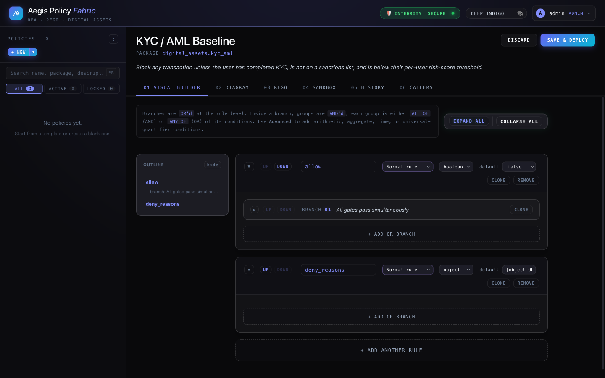](docs/images/editor/visual-builder.png) | [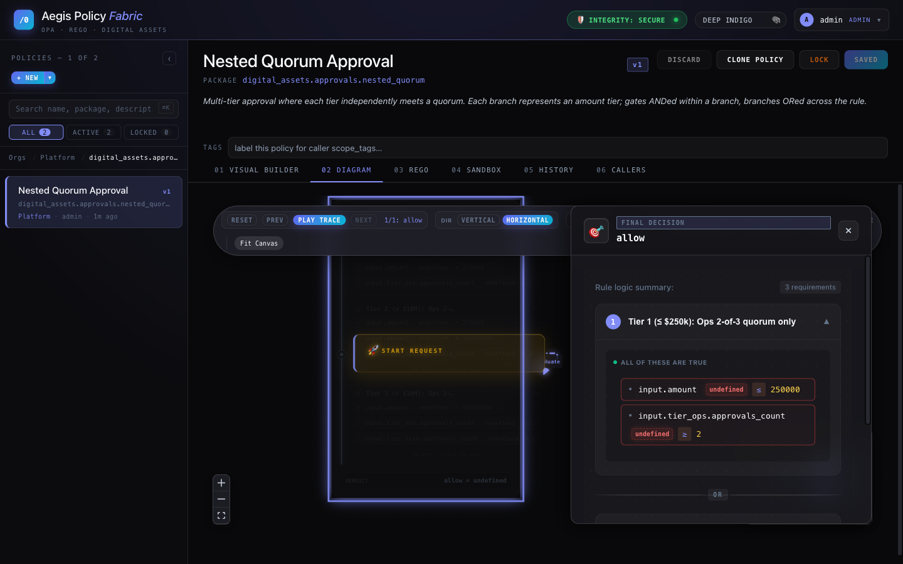](docs/images/editor/diagram-flow-tracer.png) |
| **Rego (compiled output)** | **Sandbox (Mock JWT Signer)** |
| [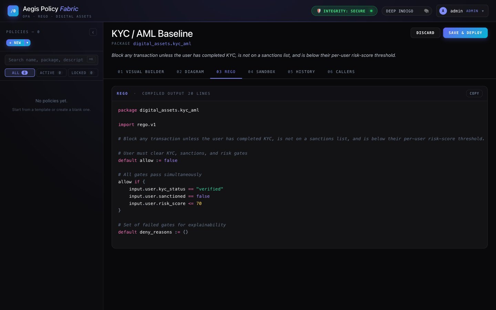](docs/images/editor/rego.png) | [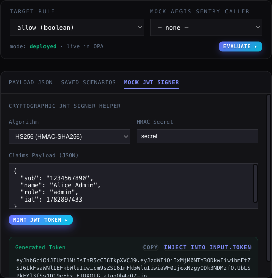](docs/images/editor/sandbox-jwt.png) |
| **History (diff + rollback)** | **Callers (per-policy grants)** |
| [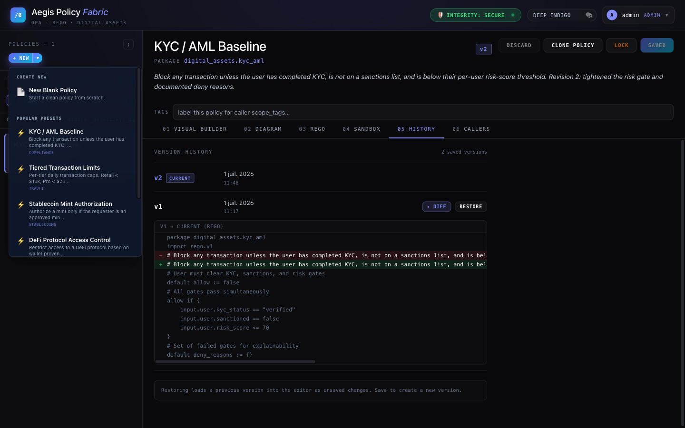](docs/images/editor/history.png) | [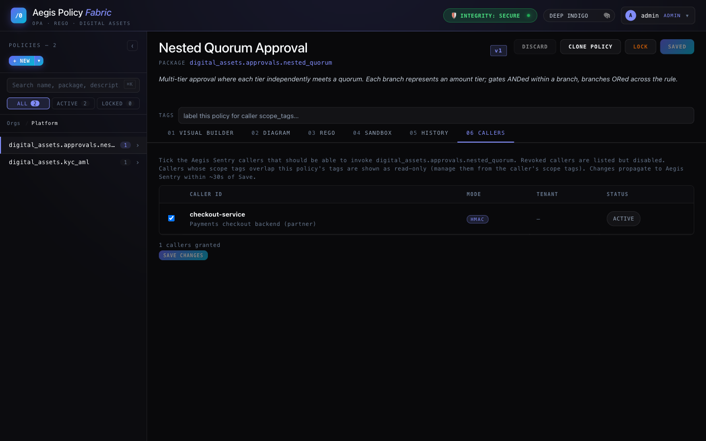](docs/images/editor/policy-callers.png) |

The **Diagram** tab is a chronological step-debugger — it topologically sorts the rule graph and sweeps a glowing path through it, with a togglable inspector that explains each branch:

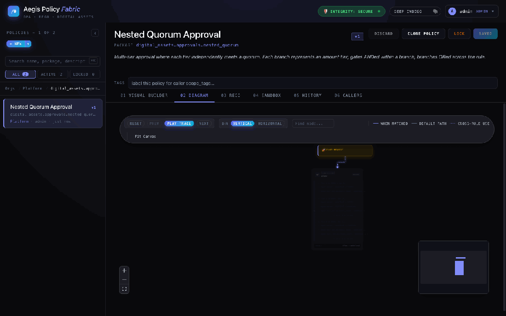

- **Unified Cryptographic HUD**: Located in the TopBar, this shield-pulse badge opens an overlay detailing engine health, audit chain structural validation, and Aegis TrustVault platform key sync status. Features highly opaque, solid backing (`0.98` opacity) and high-visibility status states (`0.15`–`0.18` background opacities) to prevent overlay text bleeding and keep data extremely legible.

  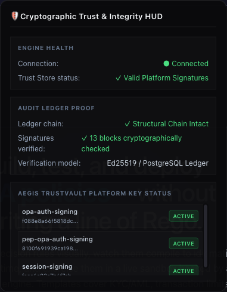
- **OPA Fleet Status Dashboard**: Accessible via the profile dropdown menu for root/super-admins. Displays real-time KPI metrics for OPA replicas, sync status, polling latency, container IP addresses, organization scopes, and a policy inspector checklist detailing active policies on each container.

  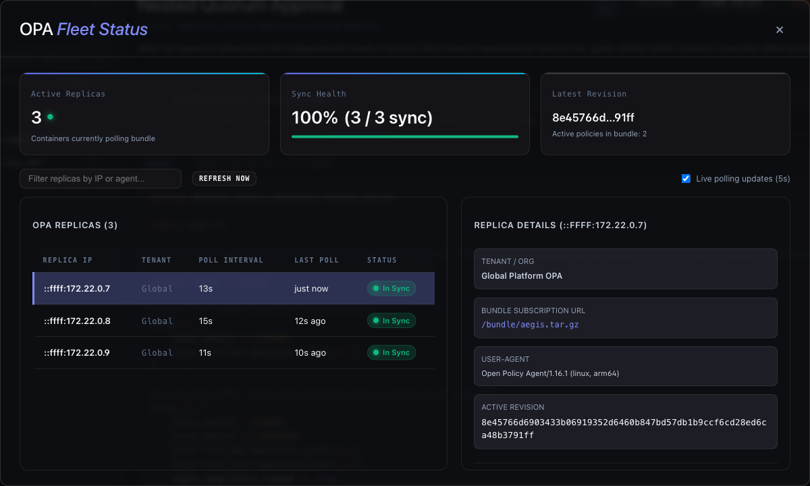
- **Lock / Unlock** — Policies are never hard-deleted. Locking drops the policy from the next bundle so it stops enforcing (eventual — within one OPA poll, ~10-20s, not instant); the row + version history stay. Unlocking re-includes it.
- **Audit log** — Sequence-ordered immutable record with a chain-verify button. For root: per-actor org column. For sub-admins: rows automatically filtered to their own org.

  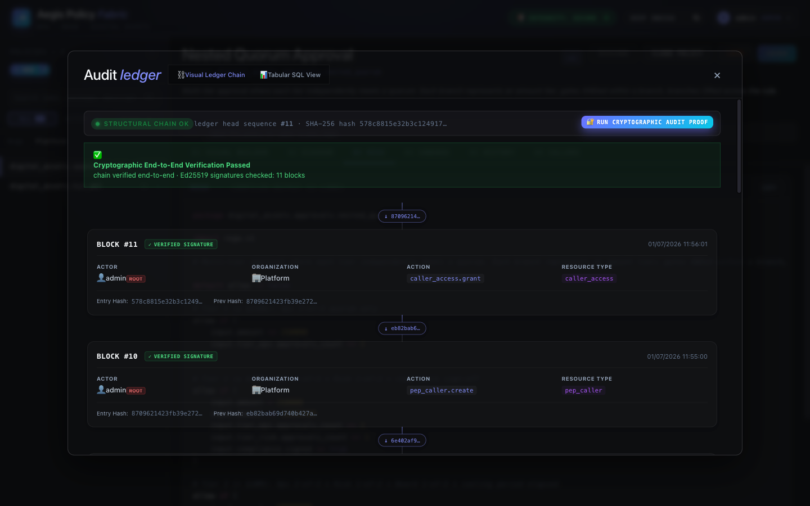
- **Manage users** — CRUD, password reset, plus org + role + `is_root` selectors on create. Sub-admins are pinned to their own org; only root can target another org or grant super-admin.

  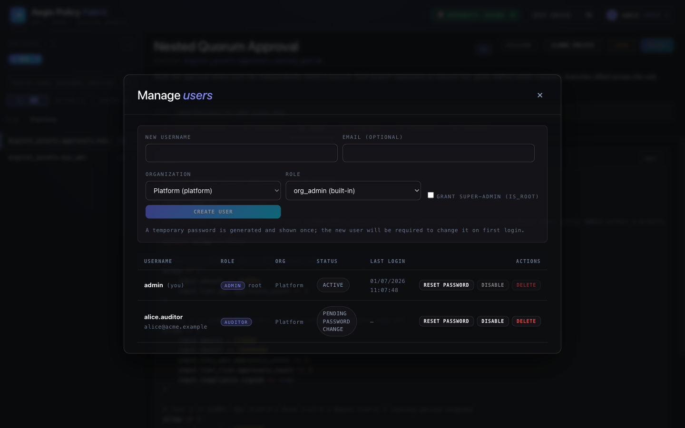
- **Organizations** (root only) — flat tenant list. Hard delete refuses if any users / policies / trust keys / Aegis Sentry callers / custom roles still belong to the org.

  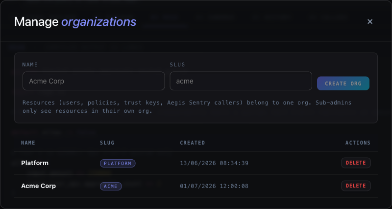

- **Roles** (root + org-admin) — manage the action × resource-type permission matrix via a click-grid. Built-in roles are read-only; sub-admins see globals + their own org's locals.

  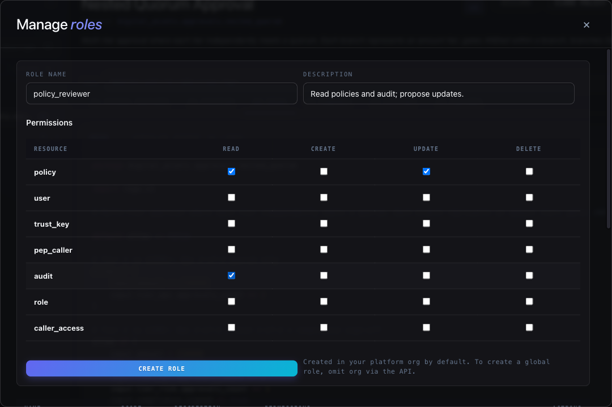
- **Trust keys** — see *Test C* below. For root: org column + org selector on create. Sub-admins create in their own org.
- **Aegis Sentry callers** — see *Test D* below. Same org column + selector pattern.

---

## Testing the DONE features

### A. `verify` condition + crypto builtins

**When you'd use this.** Any time a policy decision depends on cryptographic proof rather than a self-asserted claim in `input`. Common cases:

- *API gateway authorising a request*: only allow `POST /payments` if the caller's bearer JWT was signed by your IdP and carries `aud=payments-api`.
- *Webhook verification*: a stablecoin custody flow only proceeds if the incoming webhook body matches its HMAC-SHA256 signature.
- *Document / contract signing*: a legal-entity action is gated on an X.509 cert chain that resolves to a known CA bundle.
- *Service mesh*: Aegis Sentry forwards a workload identity token; the policy must verify the JWT against the mesh trust anchor before letting the call through.

**How to do it in the UI.**

1. **Templates → trustedAuth → Trusted JWT Gate**. This seeds a policy with the `verify` row pre-wired.
2. In the **Visual Builder**, open the rule that contains the `verify` condition. The row exposes:
   - `kind` — `jwt`, `x509`, or `raw` (HMAC).
   - `alg` — picks the matching builtin (`EdDSA`, `RS256`, `HS256`, etc.).
   - `keyRef.source` — `inline_pem`, `inline_secret`, or `data.studio.keys` (the trust store, see section B).
   - `constraints` — for `jwt`: required `iss`, `aud`, and whether `exp` / `nbf` must be present.
3. To verify against a key your tenants control, set `keyRef.source = data.studio.keys` and use a `kid` selector — either a literal kid string or `input.token_header.kid` for multi-tenant routing.
4. Switch to the **Rego** tab to see the emitted `io.jwt.decode_verify(...)` (or `crypto.x509.parse_and_verify_certificates`, or `crypto.hmac.*`) and confirm the truthy guard.
5. **Save & deploy**. The **Sandbox** tab lets you paste a sample `input` (including a real JWT) and watch the decision evaluate before any client sees it.

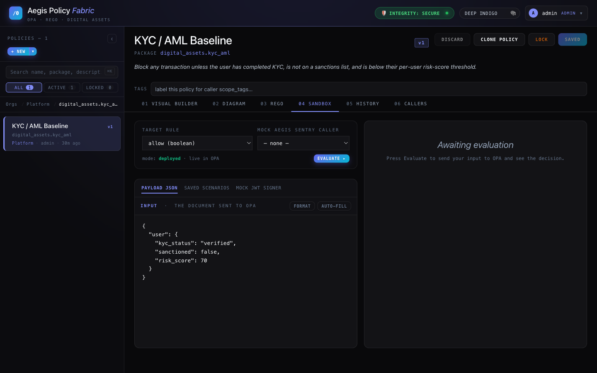

The compiler also accepts `verification`-family builtins directly if you need finer control: `io.jwt.verify_{es,rs,ps,hs}{256,384,512}`, `io.jwt.decode`, `crypto.x509.parse_and_verify_certificates`, `crypto.hmac.{sha256,sha384,sha512,equal}`, `crypto.{sha256,sha1,md5}`. MD5 and SHA-1 surface as `warnings` on `POST /api/validate` and are flagged in the emitted Rego with a `# DEPRECATED:` comment — use them only for legacy compatibility.

### B. Platform trust store

**When you'd use this.** Whenever a policy needs to verify tokens or signatures from a key the *platform* (not the policy author) controls. Examples:

- *Multi-tenant SaaS*: each tenant registers their own IdP. A single policy reads `data.studio.keys[input.token_header.kid]` and accepts whichever tenant's JWT matches the kid in the header.
- *External IdP integration*: point a row at Auth0/Okta/Azure AD via `jwks_url` and let Aegis Policy Fabric rotate pubkeys automatically as the IdP rolls them.
- *Partner / B2B*: a partner ships you their public key out-of-band. Paste it as `inline_pem` with `kid=partner-acme`; revoke the row to instantly cut them off without touching policies.
- *Webhook HMAC secrets*: store the shared secret as `inline_secret` so it isn't hard-coded into a policy spec or env file.

**How to do it in the UI.**

1. TopBar → **Trust keys** → **Add**.
2. Pick a `kid` (must be URL-safe; the compiler emits it as a literal key into `data.studio.keys["<kid>"]`).
3. Pick an `alg` (`EdDSA`, `RS256`, `ES256`, `HS256`, …).
4. Pick a `sourceKind`:
   - `inline_pem` — paste a PEM public key (asymmetric).
   - `inline_jwk` — paste a JWK (auto-canonicalised through `node:crypto.createPublicKey`).
   - `inline_secret` — HMAC secret string.
   - `jwks_url` — BYO IdP. Per-row TTL, default 30s (`TRUST_KEYS_FETCH_INTERVAL_MS`). Failures preserve last known-good and record `jwks_last_error`.
5. Save. The active set is carried in the next bundle at `data.studio.keys`, so any policy referencing `data.studio.keys["<kid>"]` starts verifying within one OPA poll — no redeploy.
6. To rotate or retire a key, hit **Revoke** on the row — it disappears from the next publish, so live policies stop accepting tokens signed by it within one publish interval. **Delete** is only available after revoke; the audit trail of the trust material stays intact.


Same actions over the API:

```bash
# Add a trust key from curl
curl -X POST http://localhost:3001/api/trust-keys \
  -H 'Authorization: Bearer <admin JWT>' \
  -H 'content-type: application/json' \
  -d '{
        "kid":"tenant-1",
        "alg":"EdDSA",
        "sourceKind":"inline_pem",
        "pem":"-----BEGIN PUBLIC KEY-----\nMCowBQYDK2VwAyEA...\n-----END PUBLIC KEY-----"
      }'
```

### C. End-to-end signed-JWT enforcement

**When you'd use this.** This is the full round-trip rehearsal — proving that a JWT minted by your platform is accepted by a deployed policy at Aegis Sentry. Use it when:

- *Going live*: smoke-testing a new policy in staging before any real traffic flows.
- *Debugging "why was I denied?"*: reproduce a caller's exact request locally with a known-good token to isolate whether the failure is in the token, the trust store, or the policy logic.
- *Onboarding a new caller*: confirming a freshly-provisioned trust key actually lets that caller through.

**How to do it in the UI / CLI.**

1. **Trust keys → Add** a row with `kid` equal to the platform audit-key fingerprint (printed in the bootstrap banner) — or use the `trustedAuth` template's expected kid.
2. Mint a test JWT signed by the platform key (CLI helper — the platform's key never leaves Vault, this just signs for you):
   ```bash
   docker compose exec backend node scripts/mint-test-jwt.js \
     --sub demo --iss https://studio.local --aud pep --ttl 300
   ```
3. **Templates → trustedAuth → Trusted JWT Gate**, then **Save & deploy**.
4. Use the **Sandbox** tab for a dry run: paste `{"token":"<jwt>"}` as input and watch the decision.
5. For the real end-to-end path, POST `/authorize` to Aegis Sentry with `input.token` set to the minted JWT (the auth headers depend on the caller's `auth_mode` — see next section).

### D. Aegis Sentry caller authentication

**When you'd use this.** Aegis Sentry sits in front of OPA; anyone who can reach it can ask for a decision. In any non-laptop deployment you need to know *which* service is asking. Aegis Sentry runs **all three modes simultaneously** — every `pep_callers` row declares its own `auth_mode`, and Aegis Sentry dispatches per request based on which credential the caller presented:

- *Internal services on the same mesh*: `mtls` — the mesh already issues workload certs, so you piggy-back on the CN.
- *External partners / customer backends*: `hmac` — give each partner a `callerId` and a one-time generated secret. Simple, no PKI required.
- *Services that already have an IdP-issued JWT*: `jwt` — verify offline against `PEP_JWKS_URL` and pin `sub` to a caller row.
- *Local dev / CI*: set `PEP_DEV_ALLOW_ANON=true` — credential-less requests are admitted as `anonymous`. Refused under `NODE_ENV=production`.

**How to provision callers in the UI.** TopBar → **Aegis Sentry callers** → **Add** → pick **Auth mode**. Per-mode fields appear conditionally; for HMAC, the plaintext secret is shown **once** in a yellow toast — copy it before closing. Subsequent reads return `[REDACTED]`. **Rotate** re-issues the secret (one-shot). **Revoke** is the soft-delete; **Delete** is only available after revoke. `auth_mode` is immutable post-create — to switch modes, revoke and re-add.


**Per-caller policy access.** Each caller row carries an explicit allowlist of policies it may call. **Manage access** on a caller row opens a checkbox view of every deployed policy (grouped by package prefix) — tick the ones this caller should be able to call, hit Save. The Policy editor's **Callers** tab is the reverse view: pick one policy, see and edit the list of callers granted to invoke it. Both panes operate on the same M:N relation and emit `caller_access.grant` / `caller_access.revoke` audit entries; grants made from either side are immediately visible from the other. New callers start with **zero** access; `/authorize` returns **403 `policy_not_in_scope`** and `/discover` returns an empty list until grants are made. The DB trigger refuses out-of-band writes so even an admin with psql access can't quietly flip a grant. Dev-anon callers (`PEP_DEV_ALLOW_ANON=true`) bypass the ACL.

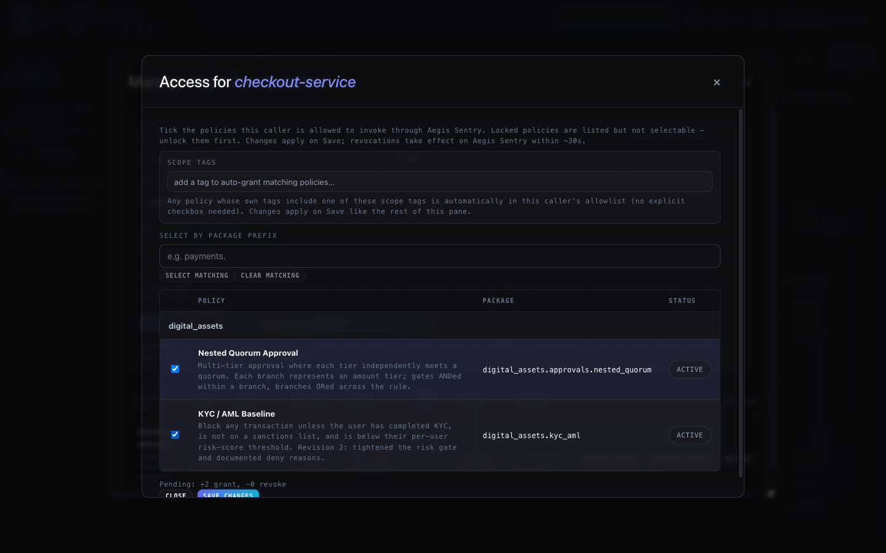

**Tags (live evaluation).** Policies and callers each carry an admin-edited tag list (`tags` on policies, `scope_tags` on callers). The Aegis Sentry ACL publisher unions explicit grants with every policy whose `tags` overlap a caller's `scope_tags` on every publish. A new policy tagged `payments` auto-appears in the allowlist of every caller with `scope_tags: ["payments"]` on the next publish (~30 s, no admin action). Tag changes audit as `policy.tags.update` / `pep_caller.scope_tags.update`. Tag-derived grants can't be revoked individually from the access pane — remove the matching tag from either side to drop them. Locked policies are filtered from the published doc regardless of tags.

For a step-by-step provisioning + per-mode client cookbook (key generation, signing, calling Aegis Sentry), see [**Dev helper — wiring up an Aegis Sentry caller**](#dev-helper--wiring-up-an-aegis-sentry-caller) below.

### E. Aegis TrustVault provider & BYOK

**When you'd use this.** The audit chain's Ed25519 private key is the root of Aegis Policy Fabric's integrity guarantees — if it leaks, an attacker can forge audit rows. The Aegis TrustVault provider abstraction lets you keep that key wherever your security posture demands:

- *Laptop / on-prem demo*: leave the default (`KMS_PROVIDER=vault`) — Vault runs in the compose stack.
- *Regulated customer ("we audit our own HSM")*: BYOK — they generate the Ed25519 key on their HSM, export PKCS#8, and ship it to you. Aegis Policy Fabric imports it on first boot and refuses to start if the fingerprint doesn't match.
- *Cloud-native deploy*: swap the provider for `aws` / `gcp` / `azure` (stubs today — see [FEATURES.md](FEATURES.md)) without touching policy code.
- *Compliance rotation*: rotate the audit key via Vault's native versioning without breaking the chain — old rows verify against the retired pubkey still cached in `audit_signing_keys`.

The audit-signing private key lives only inside the configured Aegis TrustVault provider. Public-key verification stays local against the cached pubkey in `audit_signing_keys` — Aegis TrustVault unreachable blocks new signatures, never verification.

`KMS_PROVIDER` selects the adapter:

| Provider | Status                                              |
|----------|-----------------------------------------------------|
| `vault`  | Default. HashiCorp Vault Transit. Laptop + on-prem. |
| `file`   | **DEV ONLY**. PKCS#8 PEM on disk. Refuses `NODE_ENV=production`. |
| `aws`, `gcp`, `azure`, `pkcs11` | Stubs — throw `KmsProviderNotImplemented`. Tracked in [FEATURES.md](FEATURES.md). |

#### BYOK — bring your own Ed25519 key

Either side of boot, idempotent on fingerprint match. Mismatch fails closed.

In-band (at backend boot):
```env
KMS_BYOK_SOURCE=file:/data/byok/audit.pem    # or env:VAR_NAME
KMS_BYOK_REQUIRED=true                       # refuse boot if source missing or import fails
```

Out-of-band CLI (does **not** write to the DB — next backend boot reconciles into `audit_signing_keys`):
```bash
node scripts/import-key.js \
  --source file:/path/key.pkcs8.pem \
  [--key-id audit-signing] \
  [--provider vault]
```

Exit codes: `0` success or idempotent skip · `2` config / parse error · `3` provider import failure or fingerprint mismatch.

### F. RBAC + multi-tenancy

**When you'd use this.** Aegis Policy Fabric is multi-tenant: one platform, many orgs (tenants), distinct sub-admins per org. Use it when:

- *MSP / consultancy operating policies for many customers*: each customer is an org; their internal admin manages users, policies, trust keys, and Aegis Sentry callers without seeing anyone else's data.
- *Internal platform for several product teams*: each product gets its own org; central security stays root and the teams self-serve everything else.
- *Hardening an existing single-tenant deployment*: the migration runs idempotently — legacy `role='admin'` users auto-promote to `is_root` on the next boot.

**Model.** Flat orgs (no hierarchy). Roles carry a JSONB `(action × resource_type)` permission matrix. Users carry `org_id`, `role_id`, `is_root`. Resources (`policies`, `policy_trust_keys`, `pep_callers`) carry `org_id` (NULL = global, root-only). `studio.authz` enforces: root bypass, OR `action ∈ permissions[resource_type]` AND row's `org_id == user.org_id`.

**How to do it in the UI.**

1. Log in as root. TopBar → **Organizations** → **Create org** ("Acme", slug `acme`).
2. TopBar → **Manage users** → pick org=Acme, role=`org_admin`, leave `is_root` unchecked → **Create user**. Copy the one-shot password.
3. Sign out, log in as the new Acme admin. The TopBar now shows only the menu items their permissions cover (no Organizations, no Platform keys). Every list — policies, trust keys, Aegis Sentry callers, users, audit — is scoped to Acme.
4. Create a custom role: TopBar → **Roles** → name + click-grid permission matrix → **Create**. Org admins can craft narrower roles for their own org (auditors, viewers, policy-only roles). Built-ins are immutable.
5. Cross-org probe: as the Acme admin, hit `/api/policies/<id-from-another-org>` directly → **404** (existence not leaked). Same for trust keys and Aegis Sentry callers.

**Self-escalation is refused.** Two guards in [backend/src/routes/roles.js](backend/src/routes/roles.js):

- `PUT /api/roles/:id` where `req.user.roleId === id` → **409 `SELF_ROLE_EDIT_REFUSED`**. You cannot edit the role you currently hold; another admin must do it.
- `POST` or `PUT /api/roles` with permissions exceeding the actor's own → **403 `PERMISSION_ESCALATION_REFUSED`** with `missing: { resourceType, action }` naming the offending grant.

Root bypasses both.

**Aegis Sentry is org-aware too.** Aegis Sentry callers carry `org_id` (published in `data.studio.callers`); the policy index entries carry `org_id` too. `/discover` filters candidates to the caller's org + globals; `/authorize` refuses cross-org with **403 `policy_not_in_scope`** even if a stale grant row references the policy. See [pep/src/auth/accessStore.js](pep/src/auth/accessStore.js).

**Audit visibility scales with role.** Every audit row carries `actor_org_id`. Sub-admins see only mutations performed by users in their own org; root sees the full chain. Pre-RBAC entries with NULL `actor_org_id` are root-only.

---

## Deployment scenarios

All scenarios use the same `docker-compose.yml`; only `.env` changes.

| Scenario                  | Env knobs                                                                                   | Notes |
|---------------------------|---------------------------------------------------------------------------------------------|-------|
| Laptop default            | `KMS_PROVIDER=vault`, `PEP_DEV_ALLOW_ANON=true`                                              | Out of the box. Aegis Sentry admits anonymous + any provisioned caller. |
| Laptop + BYOK             | + `KMS_BYOK_SOURCE=file:/data/byok/key.pem` (mount it into `backend`)                        | Or stage via `scripts/import-key.js` before boot. |
| Prod-shaped               | `NODE_ENV=production`, `PEP_DEV_ALLOW_ANON=false` (default)                                  | Every request must present a credential matching a `pep_callers` row. |
| Enable mTLS callers       | `PEP_TLS_CERT/KEY/CA` (all three), optional `PEP_ALLOWED_CALLERS=cn-csv`                     | Aegis Sentry listens HTTPS on 3002 with `requestCert:true`; hmac/jwt callers still work cert-less. |
| Enable JWT callers        | `PEP_JWT_ISSUER`, `PEP_JWT_AUDIENCE`, optional `PEP_JWKS_URL` (defaults to backend's JWKS)   | Without all three set the dispatcher returns `mode_not_configured` for Bearer requests. |
| Backend dev (no UI)       | `docker compose up -d backend opa postgres vault vault-init`                                 | Run `cd frontend && npm run dev` against `localhost:3001`. |
| Aegis Sentry-only smoke   | `docker compose up -d opa postgres backend vault vault-init pep`                             | Skip the frontend; curl `:3002`. |

---

## Dev helper — wiring up an Aegis Sentry caller

A complete handshake from the **Aegis Studio admin** provisioning a caller down to a **client developer** signing real requests. Each `auth_mode` has a different key-material story, so the client steps are listed separately — the admin steps are the same for all three.

### 1. Aegis Studio admin — provision a caller

1. Open <http://localhost:3000>, log in.
2. TopBar → **Manage Aegis Sentry callers** → fill the form:
   - **Caller ID** — stable identity used in audit logs, e.g. `conductor-prod`. Must match `^[A-Za-z0-9_.-]{1,64}$`.
   - **Auth mode** — `hmac` / `mtls` / `jwt`. Immutable post-create. To switch modes, revoke and re-add.
   - **Tenant** — optional informational tag.
   - Per-mode fields appear conditionally (Allowed CN for mtls, JWT subject pin for jwt).
3. Save. For HMAC mode, the generated secret is shown in a yellow toast **exactly once** — copy it now and hand it to the client out-of-band (1Password, sealed vault, etc.).
4. **Grant policy access.** Click **Manage access** on the caller row, tick the policies this caller should be able to call (or use **Select by package prefix**), Save. New callers see zero policies until you do this.
5. Day-2 operations on existing rows:
   - **Manage access** — toggle which policies this caller can call. Changes propagate to Aegis Sentry within ~30s.
   - **Rotate secret** (hmac only) — re-issues the secret. The old one stops working immediately; the new one is again one-shot.
   - **Revoke** — soft-delete. Aegis Sentry stops accepting that caller within the publish interval (~30s).
   - **Delete** — permanent, only available on revoked rows. Audit log retains the full history.

The active set is carried in the bundle at `data.studio.callers`; every mutation invalidates it and the change reaches OPA on the next poll — no Aegis Sentry restart needed.

Equivalent over the API (admin JWT required):

```bash
TOKEN=...   # from /api/auth/login

# HMAC caller — secret returned once
curl -X POST http://localhost:3001/api/pep-callers \
  -H "Authorization: Bearer $TOKEN" -H 'content-type: application/json' \
  -d '{"callerId":"conductor-prod","authMode":"hmac","tenant":"acme"}'
# → { "caller": {...}, "generatedSecret": "<save this now>" }

# mTLS caller — allowedCn required
curl -X POST http://localhost:3001/api/pep-callers \
  -H "Authorization: Bearer $TOKEN" -H 'content-type: application/json' \
  -d '{"callerId":"internal-svc","authMode":"mtls","allowedCn":"internal.svc.local"}'

# JWT caller — optional sub pin (defaults to callerId)
curl -X POST http://localhost:3001/api/pep-callers \
  -H "Authorization: Bearer $TOKEN" -H 'content-type: application/json' \
  -d '{"callerId":"partner-api","authMode":"jwt","jwtSubject":"partner-foo"}'
```

### 2. Client — HMAC mode

**Key material.** No generation on the client side — the admin generated the secret and handed it over. Store it like any other secret (Vault, 1Password, a sealed `.env`).

**Calling Aegis Sentry.** Each request carries `X-Studio-Sig: caller=<id>,ts=<unix>,nonce=<rand>,sig=<b64url>`. The signature is `HMAC-SHA256(secret, "ts.nonce.path.body")` against the **raw** request bytes — so minify the body before signing.

```bash
SECRET='LZJscdV7caGime82Tp4W83wtf_07QMjtYUNctkPrk-M'   # from the admin
CALLER='conductor-prod'
PEP='http://localhost:3002'
PATH_='/authorize'
BODY='{"policy":"payments/allow","input":{"user":{"id":"u1"},"amount":50000}}'

TS=$(date +%s)
NONCE=$(openssl rand -base64 12 | tr '+/' '-_' | tr -d '=')
SIG=$(printf '%s.%s.%s.%s' "$TS" "$NONCE" "$PATH_" "$BODY" \
  | openssl dgst -sha256 -hmac "$SECRET" -binary \
  | base64 | tr '+/' '-_' | tr -d '=')

curl -XPOST "$PEP$PATH_" \
  -H "X-Studio-Sig: caller=$CALLER,ts=$TS,nonce=$NONCE,sig=$SIG" \
  -H 'content-type: application/json' \
  -d "$BODY"
```

Failure modes:
- `ts` outside `PEP_HMAC_WINDOW_MS` (default 30s) → **401 timestamp_out_of_window**.
- Replayed nonce within the window → **409 nonce_replay**.
- Signature mismatch / unknown caller / revoked row → **401**.
- Row exists but its `auth_mode != "hmac"` → **401 auth_mode_mismatch**.

### 3. Client — JWT mode

**Key material.** Two flavours, pick the one matching where the tokens come from:

- **Platform-issued** — Aegis Policy Fabric's own session-signing key signs the tokens. Useful for internal services and for testing via `scripts/mint-test-jwt.js`. No client-side keygen.
- **External IdP** (Auth0, Okta, your own JWKS endpoint) — the admin sets `PEP_JWKS_URL`, `PEP_JWT_ISSUER`, `PEP_JWT_AUDIENCE` to the IdP's values and restarts Aegis Sentry. The client gets tokens from the IdP and presents them as-is.

**Calling Aegis Sentry.**

```bash
# Option A — platform-issued test token
TOKEN=$(docker compose exec -T backend node scripts/mint-test-jwt.js \
  --sub partner-foo --iss https://studio.local --aud pep --ttl 300)

# Option B — external IdP
# TOKEN=$(curl -s https://your-idp.example.com/oauth/token ... | jq -r .access_token)

curl -XPOST http://localhost:3002/authorize \
  -H "Authorization: Bearer $TOKEN" \
  -H 'content-type: application/json' \
  -d '{"policy":"payments/allow","input":{...}}'
```

Aegis Sentry verifies offline against the JWKS at `PEP_JWKS_URL` (default `http://backend:3001/.well-known/jwks.json`). The token's `iss` and `aud` must match `PEP_JWT_ISSUER` / `PEP_JWT_AUDIENCE`. The `sub` claim must equal the caller row's `jwt_subject` pin, or the `callerId` when no pin is set.

Failure modes:
- Signature / iss / aud mismatch → **401 invalid_jwt**.
- `sub` doesn't resolve to any jwt-mode row → **401 caller_not_allowed**.
- `iss`/`aud`/`jwks` not configured on Aegis Sentry → **401 mode_not_configured**.

### 4. Client — mTLS mode

**Key material.** The client generates its own keypair and presents a cert that chains to the CA Aegis Sentry trusts. The admin distributes `ca.crt` (Aegis Sentry's CA bundle) and adds the client's CN to the row's `allowedCn`.

```bash
# 1. Client generates a private key + certificate request.
openssl genrsa -out client.key 4096
openssl req -new -key client.key -out client.csr \
  -subj '/CN=internal.svc.local'

# 2. Exchange with the admin out-of-band:
#    - Send client.csr; receive client.crt (signed by the PEP's CA), plus ca.crt.
#    - OR: ship a self-signed client.crt and have the admin add it to the
#      PEP_TLS_CA bundle directly.
#    Admin provisions a pep_callers row with authMode=mtls,
#    allowedCn='internal.svc.local'.

# 3. Call the PEP over HTTPS (the PEP listens https when TLS material is set).
curl --cacert ca.crt --cert client.crt --key client.key \
  https://localhost:3002/authorize \
  -H 'content-type: application/json' \
  -d '{"policy":"payments/allow","input":{...}}'
```

Failure modes (stable JSON 401, not TLS alerts):
- Cert chain doesn't validate against `PEP_TLS_CA` → **401 untrusted_client_cert**.
- Cert presented without a CN → **401 client_cert_missing_cn**.
- CN not in `PEP_ALLOWED_CALLERS` AND no matching mtls row → **401 caller_not_allowed**.
- CN matches a row whose `auth_mode != "mtls"` → **401 auth_mode_mismatch**.

### 5. Mix-and-match guarantees

Aegis Sentry dispatches per request, so all three modes run side-by-side. A single deployment can host an `hmac` caller (Conductor), an `mtls` caller (an internal service), and a `jwt` caller (a partner backend) sharing the same `:3002` endpoint. The dispatcher rejects ambiguity — sending both `X-Studio-Sig` and `Authorization: Bearer` in one request returns **401 ambiguous_credentials** rather than guessing precedence. Adding, rotating, or revoking a caller is a hot operation — no Aegis Sentry restart, propagation within ~30s.

---

## Tenant Lifecycle & Dedicated OPA Provisioning Guide

Aegis Policy Fabric supports physical tenant isolation where each organization has its own dedicated, isolated OPA engine replica(s). This guide explains how root admins and operators manage the lifecycle of a tenant and its dedicated OPA containers.

### 1. Tenant Creation (Onboarding)
1. **Create the Organization**: 
   - Log in to **Aegis Studio** as a root/super-admin (`admin`).
   - Navigate to **Organizations** via the topbar menu, click **Create org**, and fill in the Name and URL-friendly Slug.
   - Alternatively, make an authorized POST call:
     ```bash
     curl -X POST http://localhost:3001/api/orgs \
       -H "Authorization: Bearer <root_jwt_token>" \
       -H "Content-Type: application/json" \
       -d '{"name": "Acme Corp", "slug": "acme"}'
     ```
2. **Obtain the Tenant UUID**:
   - Locate the newly created organization in the **Organizations** table and copy its unique `UUID` (e.g., `8f828a2a-e1cf-4f90-a548-73599dc84d5f`).

### 2. Dedicated OPA & PEP Provisioning
Because Docker Compose is a static local developer environment, creating an organization in the UI does not automatically spin up containers. In production, this is orchestrated dynamically via Kubernetes or cloud APIs.

To deploy the tenant's dedicated OPA and PEP (Aegis Sentry) containers manually:

#### A. OPA Container Setup
1. **Uncomment and Configure**: Copy the `opa-tenant-example` template in `docker-compose.yml`, assign a unique external port (e.g., `8182:8181`), and set the `OPA_BUNDLE_PATH` environment variable:
   ```yaml
   environment:
     - OPA_BUNDLE_PATH=/bundle/orgs/8f828a2a-e1cf-4f90-a548-73599dc84d5f/aegis.tar.gz
   ```
2. **Or run via CLI**:
   ```bash
   docker run -d --name opa-tenant-acme --network aegis-suite_opa-net \
     -v $(pwd)/opa/config.yaml:/config/config.yaml:ro \
     -v aegis-suite_vault_secrets:/vault/secrets:ro \
     -e OPA_BUNDLE_PATH=/bundle/orgs/8f828a2a-e1cf-4f90-a548-73599dc84d5f/aegis.tar.gz \
     openpolicyagent/opa run --server --config-file=/config/config.yaml --authentication=token --authorization=basic
   ```

#### B. PEP (Aegis Sentry) Container Setup
1. **Uncomment and Configure**: Copy the `pep-tenant-example` template in `docker-compose.yml`, assign a unique external port (e.g., `3003:3002`), and configure the target `OPA_URL` to route requests to the tenant's OPA container:
   ```yaml
   environment:
     - OPA_URL=http://opa-tenant-acme:8181
   ```
2. **Or run via CLI**:
   ```bash
   docker run -d --name pep-tenant-acme --network aegis-suite_opa-net \
     -p 3003:3002 \
     -e PEP_PORT=3002 \
     -e OPA_URL=http://opa-tenant-acme:8181 \
     -e VAULT_ADDR=http://vault:8200 \
     -e VAULT_TOKEN_FILE=/vault/secrets/pep_token \
     -v aegis-suite_vault_secrets:/vault/secrets:ro \
     aegis-suite-pep-image-name-or-build
   ```

#### C. Verify Connections
1. **Verify OPA Control Plane Sync**: Open the **OPA Fleet Status** dashboard in Aegis Studio. Verify that a replica container registers under the "Acme Corp" tenant name within 15–20 seconds, displaying its connection status, active policies, and synchronization metrics.
2. **Test PEP Decision Routing**: Submit a test authorization request to the tenant's PEP port (e.g. `:3003`):
   ```bash
   curl -X POST http://localhost:3003/authorize \
     -H "Content-Type: application/json" \
     -d '{"policy": "acme/payments", "input": {...}}'
   ```

### 3. Tenant Lock / Deactivation (Offboarding)
If a tenant needs to be deactivated or offboarded, operators can handle this in two ways:

#### Option A: Policy-Level Deactivation (Soft Lock)
- **Action**: The tenant's administrators or root admins lock all active policies owned by that organization in the Aegis Studio Visual Builder.
- **Impact on OPA**:
  - The next bundle build for this organization will emit an empty policy index.
  - The tenant's dedicated OPA container will poll, load the empty bundle, and successfully synchronize.
  - Because no custom policy modules are loaded, all custom endpoint queries route to standard system defaults, effectively disabling tenant access.
  - The OPA container remains online and "healthy" (in-sync) in the Fleet Status dashboard, but hosts no rules.

#### Option B: Organization Deletion (Hard Deactivation)
- **Action**: Delete the organization record from Aegis Studio (allowed only after its dependent users, policies, callers, and trust keys are deleted or reassigned).
- **Impact on OPA**:
  - Once the organization is deleted, the backend endpoint `/bundle/orgs/:orgId/aegis.tar.gz` immediately returns a **`404 Not Found`** status code.
  - **Running Replicas**: The tenant's running OPA containers will keep their last-loaded cached bundle in RAM but will fail all subsequent background poll requests (logging HTTP 404 errors). On the **OPA Fleet Status** dashboard, they will show a sync-drift failure status.
  - **Restarting/New Replicas**: If an OPA container for the deleted tenant restarts or a new one is launched, it will fail to retrieve a bundle. Because it cannot load the bundle containing the system authorization policies, OPA's `--authorization=basic` rules remain uninitialized, causing the container to **fail-closed (deny-all)** on all gated REST requests.
  - **Clean Up**: To complete the offboarding process, the infrastructure operator should stop and remove the tenant's OPA container.

---

## Repo layout

```
backend/             Express API, compiler, KMS adapters, audit chain (+ scripts/: mint-test-jwt, opa-trust-init)
frontend/            React/Vite SPA
pep/                 Stateless Policy Enforcement Point
opa/                 system_authz.rego + studio_authz.rego (mounted, not editable via UI)
vault/               Vault server config + init sidecar
scripts/             BYOK import CLI (import-key.js)
postgres-init/       Mounted into postgres at /docker-entrypoint-initdb.d (first-boot SQL hooks)
docker-compose.yml   Full stack (opa, postgres, vault, vault-init, backend, pep, frontend)
pep-swagger.yaml     OpenAPI spec for the PEP surface (/authorize, /discover, /healthz)
FEATURES.md          Production-hardening backlog (by area)
CLAUDE.md            Architecture deep-dive for contributors
PEP_USER_REFERENCE.md                    Client-developer guide for calling the PEP
COMPREHENSIVE-POLICY-BUILDING-USECASES.md  Policy-author field guide (condition types, trust store)
```

## Where to go next

- [FEATURES.md](FEATURES.md) — what's done, what's planned, in what order.
- [CLAUDE.md](CLAUDE.md) — internals: compiler invariants, audit-chain guarantees, route conventions.
